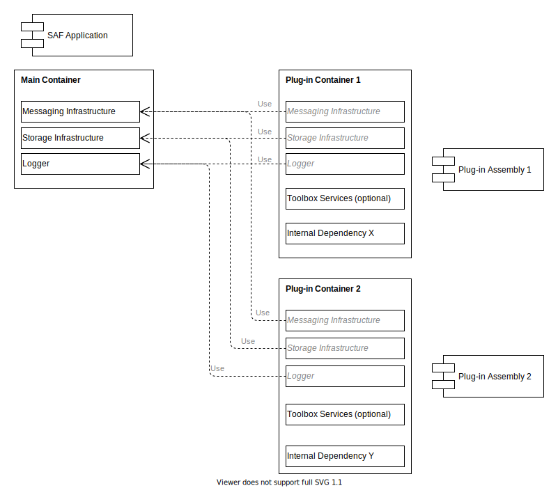

# SAF Dependency Injection (DI) Container Overview

The Smart Application Framework (SAF) utilizes Microsoft's .NET Core [Dependency Injection](https://docs.microsoft.com/aspnet/core/fundamentals/dependency-injection) to provide a main Dependency Injection (DI) container that loads various plug-ins. At its base, it provides exchangeable messaging and storage infrastructure services as well as a logging interface.

When starting to implement a SAF Host you are required to build the SAF main DI container by adding the SAF Service Host and your required [SAF Infrastructure Services](./infrastructureAndToolboxServices.md#saf-infrastructure-services) using the provided extension methods for the Microsoft DIs `IServiceCollection` interface as shown in the following exemplary code snippet:

```csharp
var applicationServices = new ServiceCollection();
applicationServices.AddHost(config => {}, null);
applicationServices.AddCdeInfrastructure(cdeConfig => {});

using var applicationServiceProvider = applicationServices.BuildServiceProvider();
applicationServiceProvider.UseServiceHost();
```

This code builds the main DI container by adding the SAF `ServiceHost` and the [C-DEngine](https://github.com/TRUMPF-IoT/C-DEngine) specific infrastructure service implementations. In addition it loads available SAF Plug-ins. While loading the SAF Plug-ins, SAF internally creates one independent DI container for each of them. It registers the infrastructure services added to the main DI container to the independent Plug-in specific DI container. With that the added SAF infrastructure can be used inside the loaded SAF Plug-ins.

Additionaly the SAF Service Host calls the Plug-ins `IServiceAssemblyManifest.RegisterDependencies` method. Inside this method the SAF Plug-in is allowed to register any type at the SAF Plug-in specific DI container that is needed inside the Plug-in itself. This could also be any of the [SAF Toolbox Services](./infrastructureAndToolboxServices.md#saf-toolbox-services) which also provide extension methods for being added to the DI container.

All services registered to the Plug-in specific DI container are isolated in that container and are therefore not accessible from inside other Plug-ins. Plug-in to Plug-in communication is therefore only possible through the messaging infrastructure service registered in the main DI container.

Afterwards the code snippet above runs the SAF application by calling the `UserServiceHost` extension method.

The following diagram shows the existing DI containers inside a SAF application:

.

The *Main Container* stores the Infrastructure Services that are shared with the Plug-ins because they are added to the Plug-in specific DI containers as well.  
The Plug-in specific containers *Plug-in Container 1* and *Plug-in Container 2* store the same Infrastructure Services and in addition the Plug-in specific services registered inside the `IServiceAssemblyManifest.RegisterDependencies` call.

This ensures to share the same Infrastructure Services with all plug-ins, whereas the Plug-in specific services are isolated from each other and can only be used inside the Plug-in itself.