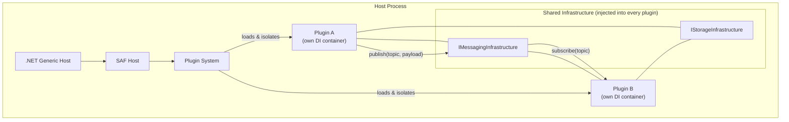

# Smart Application Framework (SAF)

SAF is an open-source, cross-platform framework for building **distributed applications** across cloud and edge. It lets you compose applications from independently deployable plug-ins that communicate exclusively through a shared messaging infrastructure — keeping plug-ins loosely coupled and independently replaceable.

## What SAF Does

SAF builds on top of .NET's `Microsoft.Extensions.Hosting` and adds:

| Layer | What it provides |
|---|---|
| **Plugin System** | Assembly-isolated plug-in loading, independent DI containers per plug-in, typed cross-plug-in service resolution |
| **SAF Host** | Opinionated host wiring: service host identity, plug-in folder discovery, optional diagnostics |
| **Messaging Infrastructure** | Exchangeable pub/sub broker (In-Process, Redis, NATS, C-DEngine, or Routing) |
| **Storage Infrastructure** | Exchangeable key/value store (LiteDB, SQLite, Redis, C-DEngine) |
| **Toolbox Services** | Ready-made helpers: Heartbeat, Request/Reply client, File Transfer |

## Core Design Principles

- **Plug-in isolation** — each plug-in gets its own DI container. Private services are invisible to other plug-ins.
- **Communication through messaging** — plug-ins never call each other directly; they publish and subscribe to topics.
- **Exchangeable infrastructure** — swap the message broker or storage backend without touching plug-in code.
- **SAF-agnostic plugin system** — the plugin loading mechanism (`SAF.PluginSystem.*`) has no SAF-specific dependencies and can be used independently.

## Architecture Overview

## Package Overview

| Package | Purpose |
|---|---|
| `SAF.Common` | Core interfaces: `IStorageInfrastructure`, `IServiceHostInfo` |
| `SAF.Messaging.Contracts` | Core interfaces: `IMessagingInfrastructure`, `IMessageHandler`, `Message` |
| `SAF.Messaging.Runtime` | Runtime wiring: resolves the primary `IMessagingInfrastructure` plug-in |
| `SAF.Messaging.InProcess` | In-memory messaging (development / tests) |
| `SAF.Messaging.Redis` | Redis-backed messaging and storage |
| `SAF.Messaging.NATS` | NATS-backed messaging and storage |
| `SAF.Messaging.Cde` | C-DEngine-backed messaging |
| `SAF.Messaging.Routing` | Fan-out / routing across multiple brokers |
| `SAF.Storage.LiteDb` | LiteDB-backed key/value storage |
| `SAF.Storage.SQLite` | SQLite-backed key/value storage |
| `SAF.PluginSystem.Hosting` | Plugin loading engine |
| `SAF.PluginSystem.Hosting.Contracts` | Plugin contracts: `IPluginManifest`, `IServicePlugin`, … |
| `SAF.Hosting` | SAF-specific host wiring on top of the plugin system |
| `SAF.Toolbox` | Heartbeat, RequestClient, FileTransfer helpers |

## Documentation

- [Getting Started](./getting-started.md) — create your first SAF application end-to-end
- [SAF Host](./saf-host.md) — initialise and configure the host
- [Plugin System](./plugin-system.md) — deep-dive into the plugin loading engine (SAF-independent)
- [Messaging Infrastructure](./messaging.md) — pub/sub how-tos and all implementations
- [Storage Infrastructure](./storage.md) — key/value store how-tos and all implementations
- [Toolbox Services](./toolbox.md) — Heartbeat, Request/Reply, File Transfer
- [Migration Guide: 10.x → 11.x](./migration-10-to-11.md) — breaking changes and upgrade steps