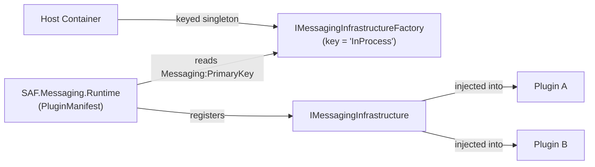

# Messaging Infrastructure

SAF's messaging infrastructure provides an **exchangeable pub/sub message bus** used by plug-ins to communicate with each other — both within the same host process and across distributed host instances.

## Interface

```csharp
namespace SAF.Messaging.Contracts;

public interface IMessagingInfrastructure
{
    void   Publish(Message message);
    object Subscribe<TMessageHandler>() where TMessageHandler : IMessageHandler;
    object Subscribe<TMessageHandler>(string routeFilterPattern) where TMessageHandler : IMessageHandler;
    object Subscribe(Action<Message> handler);
    object Subscribe(string routeFilterPattern, Action<Message> handler);
    void   Unsubscribe(object subscription);
}
```

`routeFilterPattern` is a **regular expression** applied to `Message.Topic`.

## The Message Type

```csharp
public class Message
{
    public string  Topic            { get; set; }   // routing key / topic
    public string? Payload          { get; set; }   // usually JSON
    public List<MessageCustomProperty>? CustomProperties { get; set; }
}
```

---

## Architecture: Two-Layer Registration

SAF uses a **factory pattern** so the same messaging backend can be used both as a directly-injected `IMessagingInfrastructureFactory` (keyed) and as the primary `IMessagingInfrastructure` (resolved by `SAF.Messaging.Runtime`):



The `SAF.Messaging.Runtime` plugin provides `IMessagingInfrastructure` by reading `Messaging:PrimaryKey` from configuration and selecting the matching registered factory.

When you use `builder.AddSafHost()`, `SAF.Messaging.Runtime.dll` is loaded automatically as one of SAF's built-in plugin assemblies. If you use the plugin system without `SAF.Hosting`, you must ensure that the assembly is included in your own plugin discovery configuration.

---

## Available Implementations

### In-Process (Development / Tests)

Messages are dispatched synchronously within the same process. No external dependencies.

**Package:** `SAF.Messaging.InProcess`

```csharp
builder.Services.AddInProcessMessagingInfrastructure();
```

Configuration:

```json
{ "Messaging": { "PrimaryKey": "InProcess" } }
```

### Redis

Backed by [StackExchange.Redis](https://github.com/StackExchange/StackExchange.Redis). Suitable for multi-process or multi-machine deployments.

**Package:** `SAF.Messaging.Redis`

```csharp
builder.Services.AddRedisMessagingInfrastructure(cfg =>
{
    cfg.ConnectionString = "localhost:6379";
    cfg.Timeout = 5000;
});
```

Also provides Redis-backed storage:

```csharp
builder.Services.AddRedisInfrastructure(cfg =>
{
    cfg.ConnectionString = "localhost:6379";
});
// registers both IMessagingInfrastructureFactory and IStorageInfrastructure
```

Configuration:

```json
{ "Messaging": { "PrimaryKey": "Redis" } }
```

### NATS

Backed by [NATS.Net](https://nats.io). High-performance, cloud-native messaging.

**Package:** `SAF.Messaging.NATS`

```csharp
builder.Services.AddNatsMessagingInfrastructure(cfg =>
{
    cfg.Url = "nats://localhost:4222";
});
```

Also provides NATS-backed storage:

```csharp
builder.Services.AddNatsInfrastructure(cfg =>
{
    cfg.Url = "nats://localhost:4222";
});
```

Configuration:

```json
{ "Messaging": { "PrimaryKey": "Nats" } }
```

### C-DEngine

Backed by [C-DEngine](https://github.com/TRUMPF-IoT/C-DEngine), a mesh-network framework for industrial IoT.

**Package:** `SAF.Messaging.Cde`

```csharp
builder.Services.AddCdeMessagingInfrastructure(cfg => { /* CDE options */ });
```

Configuration:

```json
{ "Messaging": { "PrimaryKey": "Cde" } }
```

### Routing (Multiple Brokers)

Routes messages across multiple messaging infrastructures based on topic patterns.

**Package:** `SAF.Messaging.Routing`

```csharp
// Register two backends first
builder.Services.AddInProcessMessagingInfrastructure();
builder.Services.AddRedisMessagingInfrastructure(cfg => cfg.ConnectionString = "localhost:6379");

// Configure routing between them
builder.Services.AddRoutingMessagingInfrastructure(cfg =>
{
    cfg.Routings = new[]
    {
        new RoutingConfiguration
        {
            Messaging = new MessagingConfiguration { Key = MessagingInfrastructureKeys.InProcess },
            PublishPatterns = new[] { "local/.*" },
            SubscriptionPatterns = new[] { "local/.*" }
        },
        new RoutingConfiguration
        {
            Messaging = new MessagingConfiguration { Key = MessagingInfrastructureKeys.Redis },
            PublishPatterns = new[] { "remote/.*" },
            SubscriptionPatterns = new[] { "remote/.*" }
        }
    };
});
```

Configuration:

```json
{ "Messaging": { "PrimaryKey": "Routing" } }
```

---

## How-To: Publish a Message

```csharp
public class OrderService(IMessagingInfrastructure messaging)
{
    public void PlaceOrder(Order order)
    {
        var payload = JsonSerializer.Serialize(order);
        messaging.Publish(new Message
        {
            Topic   = "orders/placed",
            Payload = payload
        });
    }
}
```

---

## How-To: Subscribe with a Lambda

```csharp
public class OrderNotifier(IMessagingInfrastructure messaging, ILogger<OrderNotifier> logger)
{
    private object? _subscription;

    public void Start()
    {
        _subscription = messaging.Subscribe(
            routeFilterPattern: @"orders/.*",
            handler: msg =>
            {
                var order = JsonSerializer.Deserialize<Order>(msg.Payload!);
                logger.LogInformation("Order received: {Id}", order?.Id);
            });
    }

    public void Stop() => messaging.Unsubscribe(_subscription!);
}
```

---

## How-To: Subscribe with a Typed Message Handler

Typed handlers implement `IMessageHandler` and are resolved from the plugin's DI container — useful when the handler itself has dependencies.

```csharp
public class OrderMessageHandler(IOrderRepository repository) : IMessageHandler
{
    public bool CanHandle(Message message) =>
        message.Topic.StartsWith("orders/", StringComparison.Ordinal);

    public void Handle(Message message)
    {
        var order = JsonSerializer.Deserialize<Order>(message.Payload!);
        repository.Save(order!);
    }
}
```

Register in the plugin manifest:

```csharp
public void ConfigureServices(IPluginSystemHostContext context, IServiceCollection pluginServices)
{
    pluginServices.AddSingleton<IOrderRepository, OrderRepository>();
    pluginServices.AddSingleton<OrderMessageHandler>();
    pluginServices.AddMessageHandlerResolver();  // from SAF.Messaging.Extensions
}
```

Subscribe in `IServicePlugin.StartAsync`:

```csharp
_subscription = messaging.Subscribe<OrderMessageHandler>(@"orders/.*");
```

---

## How-To: Request / Reply Pattern

Use the `IRequestClient` from `SAF.Toolbox` for request/reply over messaging. See [Toolbox Services → Request Client](./toolbox.md#request-client).

---

## How-To: Implement a Custom Messaging Infrastructure

Create a class that implements `IMessagingInfrastructure`:

```csharp
public class MyCustomMessaging : IMessagingInfrastructure
{
    public void Publish(Message message) { /* publish via your broker */ }

    public object Subscribe<TMessageHandler>() where TMessageHandler : IMessageHandler
        => Subscribe<TMessageHandler>(pattern: ".*");

    public object Subscribe<TMessageHandler>(string routeFilterPattern) where TMessageHandler : IMessageHandler
    {
        // Subscribe and return an opaque subscription handle
        return new object();
    }

    public object Subscribe(Action<Message> handler) => Subscribe(".*", handler);

    public object Subscribe(string routeFilterPattern, Action<Message> handler)
    {
        // Store handler with pattern, return handle
        return new object();
    }

    public void Unsubscribe(object subscription) { /* remove subscription */ }
}
```

Register as a keyed factory:

```csharp
builder.Services.AddKeyedSingleton<IMessagingInfrastructureFactory>("MyBroker",
    (sp, _) => new DelegatingMessagingInfrastructureFactory(
        "MyBroker",
        cfg => new MyCustomMessaging()));
```

Add to configuration:

```json
{ "Messaging": { "PrimaryKey": "MyBroker" } }
```

The `SAF.Messaging.Runtime` plugin will resolve your factory and register it as `IMessagingInfrastructure`. With `AddSafHost()`, the runtime plugin is loaded automatically; otherwise include it in your own plugin discovery setup.

---

## Well-Known Keys

```csharp
public static class MessagingInfrastructureKeys
{
    public const string Routing   = "Routing";
    public const string InProcess = "InProcess";
    public const string Redis     = "Redis";
    public const string Cde       = "Cde";
    public const string Nats      = "Nats";
}
```
