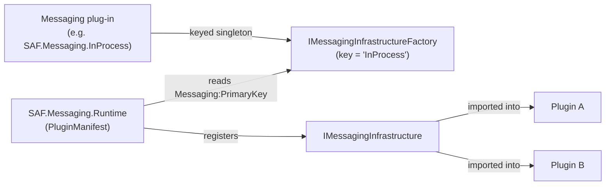

# Messaging Infrastructure

SAF's messaging infrastructure provides an **exchangeable pub/sub message bus** used by plug-ins to communicate with each other — both within the same host process and across distributed host instances.

## Interface

```csharp
namespace SAF.Messaging.Contracts;

public interface IMessagingInfrastructure
{
    void   Publish(Message message);
    object Subscribe<TMessageHandler>() where TMessageHandler : IMessageHandler;
    object Subscribe<TMessageHandler>(string routeFilterPattern) where TMessageHandler : IMessageHandler;
    object Subscribe(Action<Message> handler);
    object Subscribe(string routeFilterPattern, Action<Message> handler);
    void   Unsubscribe(object subscription);
}
```

`routeFilterPattern` is a **regular expression** applied to `Message.Topic`.

## The Message Type

```csharp
public class Message
{
    public string  Topic          { get; set; }   // routing key / topic
    public string? Payload        { get; set; }   // textual payload, usually JSON
    public byte[]? BinaryPayload  { get; set; }   // binary payload
    public MessageFormats? AcceptedReplyFormats { get; set; }   // payload formats the sender reads in a reply
    public List<MessageCustomProperty>? CustomProperties { get; set; }

    public MessageFormats GetFormat();   // payload formats present in this message
}

[Flags]
public enum MessageFormats { None = 0, Text = 1, Binary = 2 }
```

`CustomProperties` are string key/value pairs for metadata, such as a reply topic or a correlation id. Every
network transport delivers them to the receiver. On NATS this needs SAF 11.x on both sides; see [NATS](#nats).

`AcceptedReplyFormats` tells a responder which payload formats the requester can read in the reply. `null` means
the requester stated nothing and reads text only, which is what every request from SAF 10.x or older looks like.
Reply with a binary payload only if the request allows `MessageFormats.Binary`.

`AcceptedReplyFormats` reaches every SAF 11.x receiver on every network transport. Older SAF nodes ignore it, and
so do C-DEngine peers that negotiated version `1.0.0`; see
[Compatibility Between SAF Versions](#compatibility-between-saf-versions).

A message does not describe what its payloads contain: the topic defines that, and the handler interprets them. If
one topic carries different kinds of content, mark them with a custom property.

### Binary Payloads

`BinaryPayload` carries bytes without Base64 encoding them into `Payload`. A message can carry both, for example
a JSON description in `Payload` and the data in `BinaryPayload`.

Only the **In-Process** transport delivers binary payloads so far. Redis, NATS and C-DEngine cannot carry them
yet and **do not send** such a message: Redis and NATS log an error and drop it, C-DEngine drops it for every peer
and logs a warning per peer. With [Routing](#routing-multiple-brokers), each route's transport decides on its own.

### Messages Are Read-Only

Do not change a message after you publish it, and do not change a message you receive. This applies to every
transport, including the arrays in `BinaryPayload`:

- **In-Process** hands the published instance itself to every handler, and the handlers run in parallel. A change
  made by the publisher after `Publish`, or by one handler, is seen by all others.
- **C-DEngine** hands one instance of a batched message to all subscriptions of a node.
- SAF never copies `BinaryPayload`. A publisher that reuses a buffer must put a new array into each message.

To pass on changed data, create a new `Message`.

---

## Architecture: Two-Layer Registration

SAF uses a **factory pattern** so the same messaging backend can be used both as a directly-injected `IMessagingInfrastructureFactory` (keyed) and as the primary `IMessagingInfrastructure` (resolved by `SAF.Messaging.Runtime`):


```mermaid
graph LR
    MPLUG["Messaging plug-in\n(e.g. SAF.Messaging.InProcess)"] -->|keyed singleton| F["IMessagingInfrastructureFactory\n(key = 'InProcess')"]
    RUNTIME["SAF.Messaging.Runtime\n(PluginManifest)"] -->|reads Messaging:PrimaryKey| F
    RUNTIME -->|registers| I[IMessagingInfrastructure]
    I -->|imported into| PA[Plugin A]
    I -->|imported into| PB[Plugin B]
```

Each messaging implementation is itself a **plug-in**: its `PluginManifest` registers a keyed `IMessagingInfrastructureFactory`. The separate `SAF.Messaging.Runtime` plug-in reads `Messaging:PrimaryKey` from configuration, selects the matching factory, and registers the resulting `IMessagingInfrastructure` (plus `IServiceMessageDispatcher`). Because these types live in `SAF.Messaging.Contracts.dll` — a public contract assembly — they are imported into every plugin container.

**You do not register messaging in host code.** Instead you:
1. Make the implementation DLL discoverable (add it to a plugin folder container's `IncludePatterns`, e.g. `SAF.Messaging.InProcess.dll`).
2. Set `Messaging:PrimaryKey` to that implementation's key.
3. Provide the implementation's configuration section (e.g. `Redis`, `Nats`) where required.

When you use `builder.AddSafHost()`, `SAF.Messaging.Runtime.dll` is loaded automatically and `SAF.Messaging.Contracts.dll` is added to `PluginContractsSearchPattern` for you. If you use the plugin system without `SAF.Hosting`, you must include both yourself.

---

## Available Implementations

For each implementation, add its DLL to your plugin discovery `IncludePatterns` and set `Messaging:PrimaryKey`. The `Add*Infrastructure` extension methods shown are what each plug-in's own `PluginManifest` calls internally — you normally only supply configuration. To set a value from host code instead of a file, such as an id compiled into the host or a secret, see [Setting plug-in values from the host](./plugin-system.md#setting-plug-in-values-from-the-host).

### In-Process (Development / Tests)

Messages are delivered within the same process, without serialization: every matching handler receives the
published `Message` instance itself and runs on the thread pool. `Publish` returns without waiting for the
handlers. No external dependencies.

**Package / plug-in DLL:** `SAF.Messaging.InProcess` (`SAF.Messaging.InProcess.dll`)

```json
{
  "Messaging": { "PrimaryKey": "InProcess" }
}
```

### Redis

Backed by [StackExchange.Redis](https://github.com/StackExchange/StackExchange.Redis). Suitable for multi-process or multi-machine deployments. The Redis plug-in registers **both** a messaging factory and `IStorageInfrastructure`.

**Package / plug-in DLL:** `SAF.Messaging.Redis` (`SAF.Messaging.Redis.dll`)

```json
{
  "Messaging": { "PrimaryKey": "Redis" },
  "Redis": {
    "ConnectionString": "localhost:6379",
    "Timeout": 60000
  }
}
```

> The plug-in reads the `Redis` section from the plugin settings file, falling back to host configuration.

Every message goes to the channel as a versioned JSON envelope, `{"version":"2.0.0","message":{…}}`. A receiver
reads every `1.x` and `2.x` envelope. A value that is no SAF envelope at all, for example one published by
another application, is delivered with the raw value as `Payload` and the channel as `Topic`.

`AcceptedReplyFormats` is an optional field of the envelope's `message`, written only when set, with the flags
as a number: `"acceptedReplyFormats":3`. Older SAF nodes ignore it. The envelope carries text only, so a message with a `BinaryPayload` is not sent: Redis messaging logs an error and
drops it.

An envelope with an **unknown major version** comes from a newer SAF version that this node cannot read. It is
**dropped**, and a warning is logged once per unknown version. Up to 11.0.0-alpha.9 such an envelope was read as
if it were version 2, which could hand handlers a wrong message.

### NATS

Backed by [NATS.Net](https://nats.io). High-performance, cloud-native messaging. Also provides NATS-backed storage.

**Package / plug-in DLL:** `SAF.Messaging.NATS` (`SAF.Messaging.NATS.dll`)

```json
{
  "Messaging": { "PrimaryKey": "Nats" },
  "Nats": { "Url": "nats://localhost:4222" }
}
```

A subscription buffers incoming messages in a bounded channel. SAF configures that channel to **wait**
when it is full (`SubPendingChannelFullMode = BoundedChannelFullMode.Wait`), so a handler that is slower
than the publish rate applies backpressure to the reader rather than having messages dropped
silently — NATS.Net's own default is to drop the newest message instead.

**Requires NATS Server 2.2 or newer.** SAF sends the message metadata — `CustomProperties` and `AcceptedReplyFormats` —
in NATS message headers, which the server supports since version 2.2. The message body
is always the payload, exactly as in earlier SAF versions:

| Message | Body | Headers |
|---|---|---|
| Without metadata (both `null`) | `Payload` | none — identical on the wire to SAF 9.x and 10.x |
| With metadata (an empty `CustomProperties` list included) | `Payload` | `saf-v: 2.0.0` and `saf-meta: {"acceptedReplyFormats":3,"customProperties":[{"name":…,"value":…}]}`, with the fields that are set; the flags as a number |

NATS header values are ASCII, so `saf-meta` escapes every other character as a JSON `\u` sequence. A non-SAF
client that reads the header gets the original text back with any JSON parser.

- **Older SAF nodes** (9.x, 10.x and 11.0.0-alpha.9 or earlier) ignore the headers. They receive topic and
  payload as before, but no metadata: those versions never transported custom properties over NATS.
- **A NATS server before 2.2** rejects a message with headers and closes the publisher's connection. The
  message is lost, and the client reconnects. Messages without metadata are not affected.
- The body carries text only, so a message with a `BinaryPayload` is not sent: NATS messaging logs an error and
  drops it.
- A message whose `saf-v` header has an **unknown major version** comes from a newer SAF version. It is
  **dropped**, and a warning is logged once per unknown version. A message whose `saf-meta` header cannot be
  read is dropped with a warning, too. Headers of other publishers are ignored.

### C-DEngine

Backed by [C-DEngine](https://github.com/TRUMPF-IoT/C-DEngine), a mesh-network framework for industrial IoT.

**Package / plug-in DLL:** `SAF.Messaging.Cde` (`SAF.Messaging.Cde.dll`)

```json
{
  "Messaging": { "PrimaryKey": "Cde" },
  "Cde": { /* C-DEngine options */ }
}
```

The `Cde` section binds to `SAF.Cde.Common.CdeConfiguration` (package `SAF.Cde.Common`, which comes with the
plug-in).

Each peer announces its pub/sub version, and messages to it go out in the format of that version. From version
`2.0.0` on, the whole message travels as JSON, including `AcceptedReplyFormats` when it is set;
older peers ignore that field. A peer on version `1.0.0` receives the payload only. No version carries
binary payloads yet, so a message with a `BinaryPayload` is dropped for every peer, with a warning per peer in
the C-DEngine log.

The plug-in provides messaging only. For the C-DEngine storage, load `SAF.Storage.Cde.dll` as well (see
[Storage Infrastructure](./storage.md#c-dengine)); it reads the same `Cde` section.

C-DEngine runs **once per process**, shared by both C-DEngine plug-ins. Whichever of them first uses one of
its services starts it, and it shuts down when the host disposes the last of them, so the `Cde` settings take
effect at host start only. C-DEngine cannot be started a second time in the same process, so a
[live reload](./plugin-system.md#live-reload-reconfiguration) is not supported while a C-DEngine plug-in is
loaded: restart the host instead.

If you load both C-DEngine plug-ins, deploy them to the **host's base directory** (`AppContext.BaseDirectory`),
preferably through a `PackageReference` in the host, so that `SAF.Cde.Common` and C-DEngine are in the
host's `deps.json` and both plug-ins share one copy of them. A shared plug-in folder outside the base directory
is **not** enough: the plugin system loads every plug-in assembly there into its own `AssemblyLoadContext` (see
[Assembly Loading and Shared Assemblies](./plugin-system.md#assembly-loading-and-shared-assemblies)), each
with its own copy of `SAF.Cde.Common` and C-DEngine. The second copy then does not start a second node; it
fails with an `InvalidOperationException` that names both copies and says where the plug-ins belong.

Do not add `SAF.Cde.Common.dll` to `PluginContractsSearchPattern`. The plugin system would then import each
C-DEngine plug-in's `CdeConfiguration` and `CdeNodeLease` into every other plug-in container, next to that
container's own.

### Routing (Multiple Brokers)

Routes messages across multiple messaging infrastructures based on topic patterns. Load the routing plug-in **and** each backend plug-in it references (e.g. `SAF.Messaging.InProcess.dll;SAF.Messaging.Redis.dll;SAF.Messaging.Routing.dll`), then configure the routes under `MessageRouting`.

**Package / plug-in DLL:** `SAF.Messaging.Routing` (`SAF.Messaging.Routing.dll`)

```json
{
  "Messaging": { "PrimaryKey": "Routing" },
  "MessageRouting": {
    "Routings": [
      {
        "Messaging": { "Key": "InProcess" },
        "PublishPatterns": [ "local/.*" ],
        "SubscriptionPatterns": [ "local/.*" ]
      },
      {
        "Messaging": { "Key": "Redis" },
        "PublishPatterns": [ "remote/.*" ],
        "SubscriptionPatterns": [ "remote/.*" ]
      }
    ]
  },
  "Redis": { "ConnectionString": "localhost:6379" }
}
```

---

## Compatibility Between SAF Versions

SAF nodes of 9.x, 10.x and 11.x can share one broker. Each transport versions its wire format and keeps reading
the formats of older versions:

| Transport | Mixed operation with 9.x and 10.x | Changed in 11.x |
|---|---|---|
| Redis | Supported; older nodes ignore `AcceptedReplyFormats` | An envelope with an unknown major version is dropped with a warning instead of being read as version 2. `AcceptedReplyFormats` is an optional envelope field ([details](#redis)). |
| NATS | Supported; older nodes receive no `CustomProperties` or `AcceptedReplyFormats` | The metadata travels in headers; NATS Server 2.2 or newer is required ([details](#nats)). |
| C-DEngine | Supported; the format is negotiated per peer (9.x announces version `3.0.0`, 10.x and 11.x announce `4.0.0`); older nodes ignore `AcceptedReplyFormats` | `AcceptedReplyFormats` is an optional JSON field ([details](#c-dengine)). |
| In-Process | Not applicable (single process) | Nothing. |

Messages with a `BinaryPayload` are delivered by In-Process only; see [Binary Payloads](#binary-payloads).

---

## How-To: Publish a Message

```csharp
public class OrderService(IMessagingInfrastructure messaging)
{
    public void PlaceOrder(Order order)
    {
        var payload = JsonSerializer.Serialize(order);
        messaging.Publish(new Message
        {
            Topic   = "orders/placed",
            Payload = payload
        });
    }
}
```

---

## How-To: Subscribe with a Lambda

```csharp
public class OrderNotifier(IMessagingInfrastructure messaging, ILogger<OrderNotifier> logger)
{
    private object? _subscription;

    public void Start()
    {
        _subscription = messaging.Subscribe(
            routeFilterPattern: @"orders/.*",
            handler: msg =>
            {
                var order = JsonSerializer.Deserialize<Order>(msg.Payload!);
                logger.LogInformation("Order received: {Id}", order?.Id);
            });
    }

    public void Stop() => messaging.Unsubscribe(_subscription!);
}
```

---

## How-To: Subscribe with a Typed Message Handler

Typed handlers implement `IMessageHandler` and are resolved from the plugin's DI container — useful when the handler itself has dependencies.

```csharp
public class OrderMessageHandler(IOrderRepository repository) : IMessageHandler
{
    public bool CanHandle(Message message) =>
        message.Topic.StartsWith("orders/", StringComparison.Ordinal);

    public void Handle(Message message)
    {
        var order = JsonSerializer.Deserialize<Order>(message.Payload!);
        repository.Save(order!);
    }
}
```

Register in the plugin manifest:

```csharp
public void ConfigureServices(IPluginSystemHostContext context, IServiceCollection pluginServices)
{
    pluginServices.AddSingleton<IOrderRepository, OrderRepository>();
    pluginServices.AddSingleton<OrderMessageHandler>();
    pluginServices.AddMessageHandlerResolver();  // from SAF.Messaging.Extensions
}
```

Subscribe in `IServicePlugin.StartAsync`:

```csharp
_subscription = messaging.Subscribe<OrderMessageHandler>(@"orders/.*");
```

---

## How-To: Request / Reply Pattern

Use the `IRequestClient` from `SAF.Toolbox` for request/reply over messaging. See [Toolbox Services → Request Client](./toolbox.md#request-client).

---

## How-To: Implement a Custom Messaging Infrastructure

Create a class that implements `IMessagingInfrastructure`:

```csharp
public class MyCustomMessaging : IMessagingInfrastructure
{
    public void Publish(Message message) { /* publish via your broker */ }

    public object Subscribe<TMessageHandler>() where TMessageHandler : IMessageHandler
        => Subscribe<TMessageHandler>(pattern: ".*");

    public object Subscribe<TMessageHandler>(string routeFilterPattern) where TMessageHandler : IMessageHandler
    {
        // Subscribe and return an opaque subscription handle
        return new object();
    }

    public object Subscribe(Action<Message> handler) => Subscribe(".*", handler);

    public object Subscribe(string routeFilterPattern, Action<Message> handler)
    {
        // Store handler with pattern, return handle
        return new object();
    }

    public void Unsubscribe(object subscription) { /* remove subscription */ }
}
```

Expose it through a plug-in. Provide an extension method that registers a keyed factory, then call it from your plug-in's `PluginManifest` (mirroring how the built-in implementations work):

```csharp
public static class ServiceCollectionExtensions
{
    public static IServiceCollection AddMyBrokerMessagingInfrastructure(this IServiceCollection services)
        => services.AddKeyedSingleton<IMessagingInfrastructureFactory>("MyBroker",
            (sp, _) => new DelegatingMessagingInfrastructureFactory(
                "MyBroker",
                cfg => new MyCustomMessaging()));
}

public class PluginManifest : IPluginManifest
{
    public void ConfigureServices(IPluginSystemHostContext context, IServiceCollection pluginServices)
        => pluginServices.AddMyBrokerMessagingInfrastructure();
}
```

Deploy the plug-in DLL (add it to your plugin discovery `IncludePatterns`) and select it:

```json
{ "Messaging": { "PrimaryKey": "MyBroker" } }
```

The `SAF.Messaging.Runtime` plugin resolves your keyed factory and registers it as `IMessagingInfrastructure`. With `AddSafHost()`, the runtime plugin is loaded automatically; otherwise include `SAF.Messaging.Runtime.dll` in your own plugin discovery setup.

---

## Well-Known Keys

```csharp
public static class MessagingInfrastructureKeys
{
    public const string Routing   = "Routing";
    public const string InProcess = "InProcess";
    public const string Redis     = "Redis";
    public const string Cde       = "Cde";
    public const string Nats      = "Nats";
}
```
