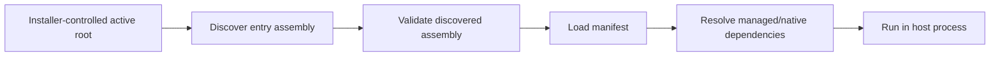

# Plugin Deployment Security

This document describes the security boundary of the current folder-based plugin loader and the deployment contract an installer must provide. It does not add package verification or dependency validation to the runtime.

## Security boundary today

The current plugin system has three relevant steps:

1. `PluginAssemblyFolderContainer` searches the configured `SearchRootPath` for files matching `IncludePatterns`.
2. Registered `IPluginAssemblyValidator` implementations validate those discovered candidate assemblies before their manifests are loaded.
3. `PluginAssemblyLoadContext` uses `AssemblyDependencyResolver` to resolve managed and native dependencies.

The validators are not invoked for files resolved later as dependencies. In particular, the current runtime does not validate every managed DLL, native library, or `.deps.json` file before it is used. A successful entry-assembly validation must therefore not be interpreted as validation of the complete plugin payload.

`AssemblyLoadContext` also provides loading and type-isolation behavior, not a security sandbox. Code loaded in-process has the privileges of the host process.



The current implementation is secure only when every file reachable from the loader is trusted and cannot be changed by an untrusted principal. A directory being writable by the installer is compatible with this requirement. A directory being writable by an attacker is not.

## Required deployment model

Use two locations with different trust levels:

```text
plugin-inbox/                 # may accept uploads; never scanned by SAF
plugin-active/                # configured as SearchRootPath; runtime read-only
  Vendor.Plugin/
    Vendor.Plugin.dll
    Vendor.Plugin.deps.json
    Vendor.Plugin.runtimeconfig.json
    dependencies/
    runtimes/
```

The exact layout may differ, but the following rules must hold:

- `SearchRootPath` points only to the active, installer-controlled location.
- The inbox and any upload directory are outside every configured search root.
- The runtime account can read and execute files in the active location, but cannot create, modify, delete, rename, or change permissions there.
- Untrusted users and plugin processes cannot write the active location or any parent directory from which they could replace it.
- The host application directory is protected by the same rules. Assemblies found there can be loaded into `AssemblyLoadContext.Default` and are therefore part of the host trust boundary.
- The installer is a separate, controlled identity. If the host process itself has write access to the plugin directory, directory protection is ineffective.

On Windows, enforce this with NTFS ACLs and a least-privileged service account. On other platforms, apply the equivalent ownership, mode, sandbox, and service-account restrictions. Do not rely on an undisclosed path, filename conventions, or the fact that a directory is not visible in the user interface.

## Installer requirements

### 1. Authenticate the complete payload

Before activation, the installer must establish that the complete plugin payload is approved. The entry assembly signature alone is not enough.

The preferred approach is a publisher-signed package or manifest containing an exact inventory and SHA-256 hash for every file that can influence loading, including:

- The entry plugin assemblies.
- Managed dependencies.
- Native libraries and runtime-specific native assets.
- `.deps.json` and other dependency-resolution metadata.
- Any additional executable or dynamically loaded code shipped with the plugin.

The host does not need a manually maintained list of dependency names. The publisher or build system generates the inventory, and the installer verifies the signed inventory as a unit. Individual dependencies may be unsigned when their exact bytes are covered by the trusted package signature and hash inventory.

If no trusted publisher, signed package, or administrator approval exists, the installer has no reliable basis for deciding whether arbitrary plugin code is safe to run in the host process. Existing Authenticode or strong-name checks cannot solve that trust decision by themselves.

The installer must reject packages with:

- An invalid signature or an unapproved publisher.
- A missing, changed, or extra code file.
- Absolute paths or paths containing traversal outside the package root.
- Duplicate paths that differ only by case or normalization.
- Reparse points, symbolic links, or junctions that escape the package root.
- A modified `.deps.json` or other load-affecting metadata after verification.

### 2. Stage before activation

The installer must never download, unpack, or update files directly under `SearchRootPath`.

Use the following sequence:

1. Receive the package in the inbox.
2. Verify its publisher identity, signature, complete file inventory, and hashes.
3. Extract it into a temporary directory on the same volume as the active location.
4. Recalculate hashes on the extracted files and repeat the path and link checks.
5. Apply the runtime read-only permissions to the staged tree.
6. Stop the host before changing anything below the active root.
7. Activate the complete directory with an atomic rename or equivalent deployment operation.
8. Start the host only after activation is complete.

Never replace a loaded DLL, native library, or `.deps.json` file in place. Keep the previous approved version outside the scanned root for rollback, or ensure the search patterns cannot discover more than the intended active version. With `Recursive = true`, multiple version directories below the search root can all become discovery candidates.

The current plugin system caches the discovered manifests and does not discover a newly deployed plugin during `ReloadAsync`. Adding a plugin or replacing a plugin payload therefore requires a controlled host restart. Live replacement while the host is running is outside the safe behavior of the current implementation.

### 3. Keep package ownership clear

Install each third-party plugin and its private dependencies as one approved payload. Do not allow a plugin directory to consume mutable dependencies from an untrusted shared directory.

Dependencies intentionally shared from the host application directory are host components. Install and update them with the host, protect them with the host installation ACLs, and include them in the host's own integrity and rollback process.

### 4. Configure discovery narrowly

`IncludePatterns` controls which DLLs are considered manifest candidates. It is not a dependency allow-list and it does not make dependency loading safe.

For production deployments:

- Prefer patterns that identify entry plugin assemblies rather than a broad `*.dll` pattern.
- List approved SAF infrastructure plugins explicitly when they are intended to be discovered.
- Keep private dependency DLLs in the plugin payload but outside the intended entry-assembly patterns.
- Use `ExcludePatterns` to avoid accidental discovery of framework and host-support assemblies, while still relying on installer trust for every loaded dependency.
- Prefer a separate folder container or search root for each trust domain when plugins have different publishers or update lifecycles.

### 5. Apply the existing runtime validators

The built-in validators are useful as an additional check for discovered entry assemblies:

```csharp
pluginSystemBuilder.AddDigitalSignaturePluginAssemblyValidator(options =>
{
    options.RequireValidDigitalSignature = true;
    options.AllowedSignerThumbprints.Add("AABBCCDDEEFF00112233445566778899AABBCCDD");
});
```

This verifies the files selected as manifest candidates. It does not verify their dependencies. Keep the installer package or file-inventory verification as the control that authenticates unsigned dependencies.

Strong names should be treated similarly: they identify an assembly key and help detect changes to the assembly, but they are not a replacement for publisher trust, package integrity, or filesystem protection.

## Current security profile

| Deployment condition | Current in-process posture |
|---|---|
| Installer writes a staged package; runtime reads a protected active root | Supported security profile |
| Third party uploads to an inbox that is never scanned; installer approves and activates packages | Supported when the installer performs complete package trust checks |
| Every managed and native file has an approved Authenticode signature | Strict additional profile; compatible but not required for unsigned dependencies |
| An untrusted user can write, replace, or delete files below `SearchRootPath` | Not secure for in-process loading |
| Arbitrary plugins must be accepted without publisher or administrator trust | Requires an out-of-process worker and OS isolation |

No runtime validator can close the writable-directory case by itself. A validate-then-load sequence remains vulnerable if an attacker can replace the validated path before or during loading.
