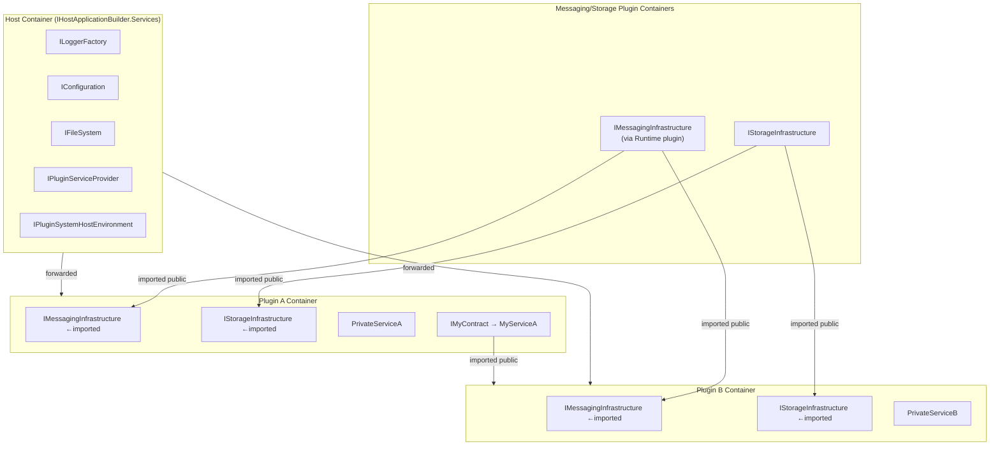
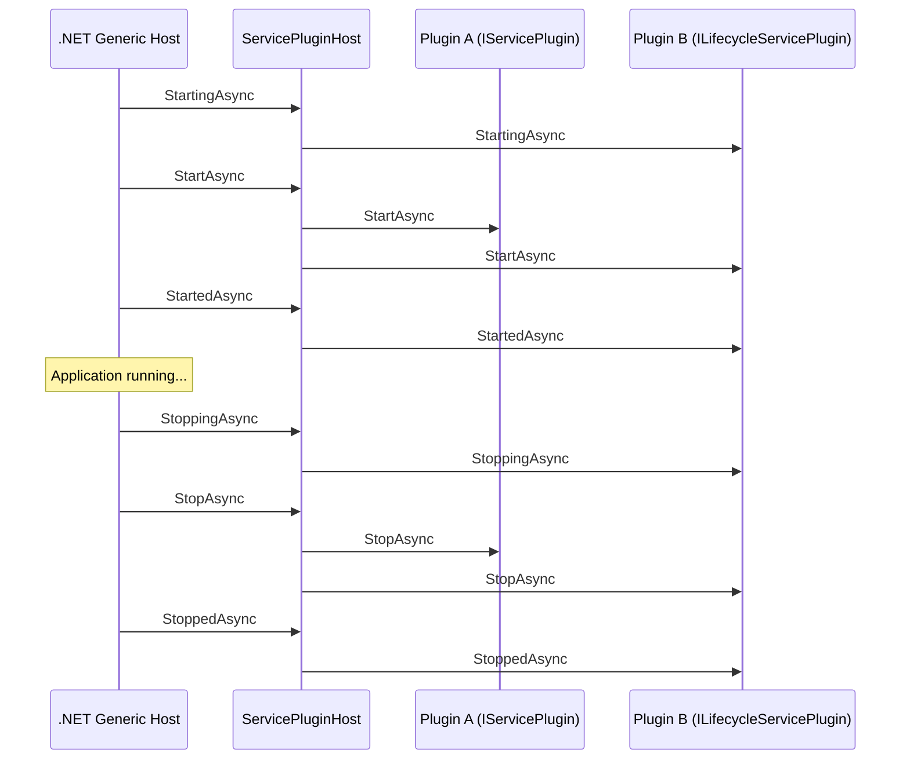
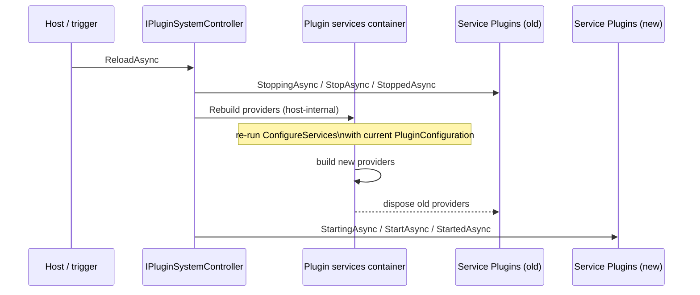

# Plugin System

The plugin system (`SAF.PluginSystem.*`) is a **SAF-independent** assembly loading engine that:

- Scans directories for assemblies containing `IPluginManifest` implementations
- Creates an **isolated `IServiceProvider`** for each discovered plug-in
- Forwards a set of **shared services** (from the host container) into every plugin container
- Manages the lifecycle of `IServicePlugin` and `ILifecycleServicePlugin` implementations
- Makes **public contract services** available for constructor injection in every plugin container
- Provides `IPluginServiceProvider` as a fallback for dynamic/late-bound cross-plugin resolution
- Can rebuild all plugin containers in-process from the current configuration (`IPluginSystemController.ReloadAsync`)

SAF uses the plugin system as its foundation and adds messaging, storage, and host-info on top, but the plugin system itself has no dependency on SAF.

For the security boundary of the current folder-based loader and the installer requirements for
in-process third-party plugins, see [Plugin Deployment Security](./plugin-security.md).

---

## Core Concepts

### IPluginManifest

Every plug-in assembly should contain **exactly one** concrete class implementing `IPluginManifest`. This is the single entry point the plugin system uses to configure the plug-in's DI container.

During discovery, the plugin loader instantiates the first concrete, non-abstract `IPluginManifest` implementation it finds and ignores assemblies that only contain the interface or other non-instantiable types.

```csharp
using Microsoft.Extensions.DependencyInjection;
using SAF.PluginSystem.Hosting.Contracts;

namespace MyPlugin;

public class PluginManifest : IPluginManifest
{
    public void ConfigureServices(IPluginSystemHostContext context, IServiceCollection pluginServices)
    {
        // Register services into the plugin's own isolated DI container
        pluginServices.AddSingleton<MyPrivateService>();
        pluginServices.AddSingleton<IMyPublicContract, MyPublicService>();

        // Register a lifecycle participant
        pluginServices.AddServicePlugin<MyBackgroundWorker>();
    }
}
```

The `IPluginSystemHostContext` provides:

| Member | Type | Description |
|---|---|---|
| `Environment` | `IPluginSystemHostEnvironment` | Environment name, plugin settings root path |
| `HostConfiguration` | `IConfiguration` | Host-wide config (e.g. `appsettings.json`) |
| `PluginConfiguration` | `IConfiguration` | Plugin-specific config (e.g. `pluginsettings.json`), change-tracked while the process runs |

### IServicePlugin

Implement `IServicePlugin` to participate in the host's start/stop lifecycle. Register via `AddServicePlugin<T>()`:

```csharp
using SAF.PluginSystem.Hosting.Contracts;

namespace MyPlugin;

public class MyBackgroundWorker(IMessagingInfrastructure messaging) : IServicePlugin
{
    private object? _subscription;

    public Task StartAsync(CancellationToken token)
    {
        _subscription = messaging.Subscribe("my/topic", msg => Handle(msg));
        return Task.CompletedTask;
    }

    public Task StopAsync(CancellationToken token)
    {
        if (_subscription is not null)
            messaging.Unsubscribe(_subscription);
        return Task.CompletedTask;
    }

    private void Handle(Message msg) { /* ... */ }
}
```

### ILifecycleServicePlugin

For phased initialization, implement `ILifecycleServicePlugin` (extends `IServicePlugin` with `StartingAsync`, `StartedAsync`, `StoppingAsync`, `StoppedAsync`):

```csharp
public class MyLifecyclePlugin : ILifecycleServicePlugin
{
    public Task StartingAsync(CancellationToken token)
    {
        // Called before StartAsync — open connections, acquire resources
        return Task.CompletedTask;
    }

    public Task StartAsync(CancellationToken token)
    {
        // Main start logic
        return Task.CompletedTask;
    }

    public Task StartedAsync(CancellationToken token)
    {
        // Called after StartAsync — announce readiness
        return Task.CompletedTask;
    }

    public Task StoppingAsync(CancellationToken token)
    {
        // Called before StopAsync — begin graceful shutdown
        return Task.CompletedTask;
    }

    public Task StopAsync(CancellationToken token)
    {
        // Main stop logic
        return Task.CompletedTask;
    }

    public Task StoppedAsync(CancellationToken token)
    {
        // Called after StopAsync — release resources
        return Task.CompletedTask;
    }
}
```

The lifecycle order follows `IHostedLifecycleService` semantics, executed sequentially across all plugins:

```
StartingAsync → StartAsync → StartedAsync
StoppingAsync → StopAsync  → StoppedAsync
```

---

## DI Containers

The plugin system maintains one DI container per plugin. The host forwards a fixed set of common services into every plugin container, while public contract services registered by one plugin are imported into the others.



> `IMessagingInfrastructure` and `IStorageInfrastructure` are ordinary public contract services provided by the messaging/storage plug-ins — they reach other plugin containers through the same import mechanism as any application contract, not through host forwarding.


**Key rules:**

- Services registered in a plugin container are **private by default** — other plugins cannot resolve them unless they are registered against a **publicly accessible interface** (an interface in a shared "contracts" assembly).
- Public contract services registered in any plugin container are **injected into every other plugin container** automatically — consume them via normal constructor injection.
- `IPluginServiceProvider` is available as a fallback for dynamic or late-bound scenarios but is a Service Locator — prefer constructor injection.
- If multiple plugins register the same interface and `IPluginServiceProvider` is used, `GetService<T>()` throws; use `GetServices<T>()` instead.
- Host services are **not** forwarded automatically. Only the services listed below and any `IHostServiceForwarder` registrations are bridged into plugin containers.

### Services forwarded into every plugin container

| Service | Notes |
|---|---|
| `ILoggerFactory` / `ILogger<T>` | Shared logging pipeline |
| `IPluginServiceProvider` | Cross-plugin service resolution |
| `IPluginSystemHostEnvironment` | Environment name, settings root path |
| `IFileSystem` | Abstracted file system |

Additional services can be bridged explicitly via `IHostServiceForwarder` (see below).

### IHostServiceForwarder

To forward an additional host service into every plugin container, register a `HostServiceForwarder<T>` in the host's `IServiceCollection`:

```csharp
// Register the service in the host container
services.AddSingleton<MySharedService>();

// Bridge it into every plugin container
services.AddSingleton<IHostServiceForwarder, HostServiceForwarder<MySharedService>>();
```

`HostServiceForwarder<T>` is resolved from the host container (receiving the already-built singleton via constructor injection) and calls `pluginServices.AddSingleton(instance)` for each plugin — one shared instance, no factory, no service locator.

Implement `IHostServiceForwarder` directly for more control, e.g. to register a service under a different interface:

```csharp
public sealed class MyForwarder(MySharedService service) : IHostServiceForwarder
{
    public void Forward(IServiceCollection pluginServices)
        => pluginServices.AddSingleton<IMyContract>(service);
}
```

> **Forward instances, not factories.** Register the resolved host instance (`AddSingleton(instance)`), never a factory delegate that returns a host service (`AddSingleton(_ => hostProvider.GetRequiredService<T>())`). A plugin container disposes the singletons it created itself, so a factory-forwarded service would be disposed together with the plugin container — for example on a [live reload](#live-reload-reconfiguration) — while the host still uses it. Instance registrations are not owned by the plugin container and survive. The built-in forwarded services (`IPluginServiceProvider`, `IPluginSystemHostEnvironment`, `IFileSystem`) are additionally shielded by a non-owning proxy, so their `Dispose`/`DisposeAsync` calls never reach the host instance.

---

## Cross-Plugin Services

### Messaging Handlers in Plug-ins (Required)

If a plug-in uses typed messaging subscriptions (`Subscribe<TMessageHandler>()`), the handler type **must** be registered via the extensions from `SAF.Messaging.Extensions`.

Do **not** register message handlers only as `IMessageHandler` (for example `AddSingleton<IMessageHandler, MyHandler>()`).
The SAF messaging runtime resolves handlers by their concrete type. Interface-only registrations are not resolved.

Required setup in the plug-in manifest:

```csharp
using SAF.Messaging.Extensions;

public void ConfigureServices(IPluginSystemHostContext context, IServiceCollection pluginServices)
{
    pluginServices.AddSingletonMessageHandler<MyHandler>();
    // or pluginServices.AddTransientMessageHandler<MyHandler>();

    pluginServices.AddMessageHandlerResolver();
}
```

If this is not configured, typed handlers will not be resolved by SAF's messaging system.

### Registering a Public Service

In your plugin manifest, register the service against a **contract interface** defined in a shared assembly:

```csharp
// MyApp.Contracts assembly (referenced by both plugins and the host)
public interface IOrderService
{
    IEnumerable<Order> GetPending();
}
```

```csharp
// Plugin A manifest
pluginServices.AddSingleton<IOrderService, OrderServiceImpl>();
```

### Consuming a Public Service from Another Plugin

The plugin system automatically makes public contract services available in every plugin container. Consume them via **constructor injection** — no service locator needed:

```csharp
// Plugin B — IOrderService is injected directly from Plugin A's registration
public class OrderConsumer(IOrderService orderService)
{
    public void ProcessOrders()
    {
        var orders = orderService.GetPending();
        // ...
    }
}
```

> The host must make the contracts assembly discoverable through `PluginContractsSearchPattern` so the plugin system can recognise the public types. When you use `AddSafHost()`, SAF's own contract assemblies are already included and your configured patterns only need to cover additional application-specific contracts.

### IPluginServiceProvider (fallback only)

For dynamic or late-bound scenarios where the service type is not known at compile time, `IPluginServiceProvider` is available. Prefer constructor injection whenever possible — `IPluginServiceProvider` is a Service Locator.

```csharp
// Use only when constructor injection is not applicable
public class DynamicConsumer(IPluginServiceProvider pluginServices)
{
    public void ProcessOrders()
    {
        var orders = pluginServices.GetService<IOrderService>();
        // ...
    }
}
```

---

## Using the Plugin System Without SAF

The plugin system has no dependency on SAF infrastructure. You can use it with a plain .NET host:

```csharp
var builder = Host.CreateApplicationBuilder(args);

var pluginSystemBuilder = builder.AddPluginSystem(options =>
{
    options.PluginSettingsRootPath = "./config";
});

pluginSystemBuilder.AddPluginAssemblyFolderContainer(options =>
{
    options.SearchRootPath = AppContext.BaseDirectory;
    options.IncludePatterns = "MyApp.Plugin.*.dll";
});

// Register host services that should be forwarded into every plugin container
builder.Services.AddSingleton<IMySharedService, MySharedService>();
builder.Services.AddSingleton<IHostServiceForwarder, HostServiceForwarder<IMySharedService>>();

var host = builder.Build();
await host.RunAsync();
```

Services are **not** forwarded into plugin containers automatically. Use `IHostServiceForwarder` / `HostServiceForwarder<T>` to bridge specific host services explicitly.

---

## Assembly Validation (optional)

Plugin assembly validation is opt-in. SAF does not enable validators by default.

Validators run for assemblies selected as discovery candidates, before their manifests are loaded.
They do not validate managed or native dependencies resolved later by
`AssemblyDependencyResolver`. Entry-assembly validation is therefore an additional check, not a
replacement for the protected active-directory requirements described in
[Plugin Deployment Security](./plugin-security.md).

To validate plug-ins before loading, register one or more `IPluginAssemblyValidator` implementations. Validators are executed in registration order and can reject loading by returning `PluginAssemblyValidationResult.Rejected(...)`.

Contracts for this feature (`IPluginAssemblyValidator`, `PluginAssemblyValidationContext`, `PluginAssemblyValidationResult`) are part of `SAF.PluginSystem.Hosting.Contracts`.

SAF provides built-in validators in `SAF.PluginSystem.Hosting.Extensions`:

- `AddStrongNamePluginAssemblyValidator(...)`
- `AddDigitalSignaturePluginAssemblyValidator(...)`

To use these helper extension methods, reference package `SAF.PluginSystem.Hosting.Extensions`.

```csharp
using SAF.PluginSystem.Hosting;
using SAF.PluginSystem.Hosting.Extensions;

var builder = Host.CreateApplicationBuilder(args);

var pluginSystemBuilder = builder.AddPluginSystem(_ => { });

pluginSystemBuilder.AddPluginAssemblyFolderContainer(options =>
{
    options.SearchRootPath = AppContext.BaseDirectory;
    options.IncludePatterns = "MyApp.Plugin.*.dll";
});

// Optional strong-name validation
pluginSystemBuilder.AddStrongNamePluginAssemblyValidator(options =>
{
    options.RequireStrongName = true;
    options.AllowedPublicKeyTokens.Add("0011223344556677");
});

// Optional Authenticode validation
pluginSystemBuilder.AddDigitalSignaturePluginAssemblyValidator(options =>
{
    options.RequireValidDigitalSignature = true;
    options.AllowedSignerThumbprints.Add("AABBCCDDEEFF00112233445566778899AABBCCDD");
});
```

The hosting pipeline opens each candidate once with `FileShare.Read`, reads it into a content snapshot, validates that snapshot, and loads the file itself with `LoadFromAssemblyPath` while the handle is still open. `Assembly.Location` therefore reports the deployment path on every platform.

How much the pipeline can guarantee about the file it loads depends on the platform:

- **Windows**: `FileShare.Read` denies every subsequent open that asks for write or delete access, so the candidate can neither be modified nor swapped between validation and load. The handle pins the validated file.
- **Linux and macOS**: POSIX has no mandatory locking, so a held descriptor cannot stop the *path* from being replaced. When at least one validator is registered, the file is re-read and compared against the validated snapshot immediately before the load, and a mismatch skips the candidate with a warning. This shortens the window between validation and load to the load call itself. It does not close it.

Neither mechanism extends to the plugin's dependencies. Managed and native dependencies are resolved from the deployment folder by `AssemblyDependencyResolver` when they are first needed, without validation and without either guarantee above, which is why the protected active directory described in [Plugin Deployment Security](./plugin-security.md) remains the control that matters.

Candidates that sit in `AppContext.BaseDirectory` are loaded into `AssemblyLoadContext.Default`, whose binder resolves by assembly *identity* first. If an assembly of that identity is already loaded, or ships with the host and is therefore on the default binder's list of platform assemblies, that one wins and the validated file is never loaded. `SAF.Messaging.Runtime.dll` is the case you are most likely to meet: `AddSafHost` discovers it from the base directory, where the host's own package reference has already placed it. Validation still runs for such a candidate, but it does not decide which bytes end up in the process.

The digital-signature validator reads the Authenticode signature from the PE certificate table and recomputes the PE hash to confirm that the signature covers the file. Signer trust is decided by `WinVerifyTrust` on Windows and by `X509Chain` against the platform certificate store elsewhere; the semantics differ, because the cross-platform verifier validates only the certificate chain and leaves file integrity to the PE hash check, whereas `WinVerifyTrust` also applies the Authenticode policy layer above the chain.

Custom validation can be added with your own validator implementation:

```csharp
using Microsoft.Extensions.Hosting;
using SAF.PluginSystem.Hosting;
using SAF.PluginSystem.Hosting.Contracts;
using SAF.PluginSystem.Hosting.Extensions;

public sealed class MyAssemblyValidator : IPluginAssemblyValidator
{
    public PluginAssemblyValidationResult Validate(PluginAssemblyValidationContext context)
    {
        // Use AssemblyBytes for content checks; AssemblyPath identifies the discovered file.
        return PluginAssemblyValidationResult.Accepted();
    }
}

public static class Program
{
    public static void Main(string[] args)
    {
        var builder = Host.CreateApplicationBuilder(args);
        var pluginSystemBuilder = builder.AddPluginSystem(_ => { });

        // Register in chain order
        pluginSystemBuilder.AddPluginAssemblyValidator<MyAssemblyValidator>();
    }
}
```

---

## Plugin Settings

All plugins share a single plugin settings file, exposed to each manifest as `context.PluginConfiguration`. The plugin system loads it from:

```
{PluginSettingsRootPath}/{PluginSettingsFilePath}
```

with `PluginSettingsRootPath` defaulting to `./config` and `PluginSettingsFilePath` defaulting to `./pluginsettings.json`. An optional environment-specific overlay named `{file}.{EnvironmentName}.json` (e.g. `pluginsettings.Development.json`) is layered on top if present. Both paths come from the `PluginSystem` configuration section.

`PluginSystemOptions` stays a pure data object (paths/patterns only). To add further plugin configuration providers from outside (for example XML, INI, custom sources, or application-specific file names/extensions), use the host builder API:

```csharp
var builder = Host.CreateApplicationBuilder(args);

var pluginSystemBuilder = builder.AddPluginSystem(options =>
{
    options.PluginSettingsFilePath = "./pluginsettings.json";
});

pluginSystemBuilder.AddPluginConfigurationSource(source =>
{
    var extension = ".myapp";
    var overlayFileName = $"{Path.GetFileNameWithoutExtension(source.SettingsFileName)}.{source.EnvironmentName}" +
        Path.GetExtension(source.SettingsFileName);

    source.Builder.AddXmlFile(xml =>
    {
        xml.FileProvider = source.SettingsFileProvider;
        xml.Path = Path.ChangeExtension(source.SettingsFileName, extension);
        xml.Optional = true;
        xml.ReloadOnChange = true;
        xml.OnLoadException = source.OnLoadException;
    });

    source.Builder.AddXmlFile(xml =>
    {
        xml.FileProvider = source.SettingsFileProvider;
        xml.Path = Path.ChangeExtension(overlayFileName, extension);
        xml.Optional = true;
        xml.ReloadOnChange = true;
        xml.OnLoadException = source.OnLoadException;
    });
});
```

The callback receives a `PluginConfigurationSourceContext` with everything the built-in plugin settings
pipeline already resolved: `SettingsFileProvider` (the `IFileProvider` scoped to the resolved settings
directory — the same instance the default plugin JSON files use), `SettingsFileName` (e.g.
`pluginsettings.json`), `EnvironmentName`, and `OnLoadException` (the shared handler that ignores a failed
load and logs a warning instead of crashing host startup or silently wiping values on reload). Building
sources through `source.SettingsFileProvider` keeps them rooted at the same directory as the default plugin
JSON regardless of how `PluginSettingsRootPath` resolves — there is no separate path to keep in sync.

The callback runs exactly once, during `IPluginSystemHostContext` construction; any exception it throws
propagates into host startup. Additional providers are appended after the default plugin JSON sources.
Configuration precedence follows normal .NET rules (later providers override earlier ones).

Because the file is shared, plugins keep their settings under distinct top-level sections (the built-in messaging/storage plugins use `Messaging`, `Redis`, `Nats`, `LiteDb`, `SQLite`, `MessageRouting`).

Access your section via `context.PluginConfiguration` in `ConfigureServices`:

```csharp
public void ConfigureServices(IPluginSystemHostContext context, IServiceCollection pluginServices)
{
    pluginServices.Configure<MyPluginOptions>(
        context.PluginConfiguration.GetSection("MyPlugin"));
}
```

Example `pluginsettings.json`:

```json
{
  "MyPlugin": {
    "IntervalSeconds": 10,
    "Topic": "myapp/events/ping"
  }
}
```

> A plugin may also fall back to host configuration (`context.HostConfiguration`) — the built-in plugins read their section from `PluginConfiguration` first and fall back to `HostConfiguration`. In the simplest setups you can point `PluginSettingsFilePath` at the host's `appsettings.json` and keep everything in one file.
>
> If you use `AddXmlFile(...)`, add the package `Microsoft.Extensions.Configuration.Xml` to the host project.

### Change tracking

Both settings files are registered with change tracking enabled, using a file provider scoped to the resolved settings directory. `context.PluginConfiguration` therefore reflects edits made to the files while the process runs — a plugin that binds via `IOptionsMonitor<T>` or registers on `IConfiguration.GetReloadToken()` sees new values without a restart.

Two consequences of the watcher:

- The settings directory must exist to be watched. The plugin system creates it if it is missing.
- A malformed or half-written settings file does not fail the host. The load error is logged as a warning, the previously loaded values stay in effect, and the next successful load applies the updated values.

Picking up changed *values* is separate from re-creating plugin *instances*: re-running `ConfigureServices` requires an explicit reload, see [Live Reload](#live-reload-reconfiguration).


---

## Lifecycle Sequence Diagram



---

## Live Reload (Reconfiguration)

The plugin system can rebuild its DI containers **in-process** from the current
`context.PluginConfiguration`, without restarting the host and without recreating the underlying
assembly load contexts (ALCs). This enables live reconfiguration: after the plugin settings change,
each manifest's `ConfigureServices` runs again against the fresh configuration, producing new plugin
service instances while the loaded assemblies stay in place.

The public reload API is:

| API | Assembly | Responsibility |
|---|---|---|
| `IPluginSystemController.ReloadAsync(CancellationToken)` | `SAF.PluginSystem.Hosting.Contracts` | Host-level orchestration: runs the stop lifecycle of the running service plugins, rebuilds the plugin service providers, then runs the start lifecycle on the new instances. |
| `IPluginServicesContainer.IsInitialized` | `SAF.PluginSystem.Hosting.Contracts` | `false` until the plugin containers have been built (which happens on first use, i.e. at host start). Use it to check whether a reload is possible at all. |

The provider rebuild step itself is intentionally kept behind a host-internal writer abstraction and is not exposed on the public read contract.

`IPluginSystemController` is registered automatically by `AddPluginSystem` — resolve it from the host
container (or via constructor injection) and call `ReloadAsync` when the configuration changes:

```csharp
public class ConfigChangeWatcher(IPluginSystemController pluginSystem)
{
    // e.g. wired to IOptionsMonitor.OnChange or a file watcher
    public Task OnConfigurationChangedAsync(CancellationToken token)
        => pluginSystem.ReloadAsync(token);
}
```

### Reload phases

A reload runs the **complete** service-plugin lifecycle around the provider rebuild — the same phases the
.NET host runs at startup and shutdown, so `ILifecycleServicePlugin` implementations are honored:

```
StoppingAsync → StopAsync → StoppedAsync      on the old instances
             ↓ rebuild plugin service providers ↓
StartingAsync → StartAsync → StartedAsync     on the new instances
```

### What a reload does — and does not — do

- **Rebuilds** every plugin's DI container by re-running `IPluginManifest.ConfigureServices` with the
  current `PluginConfiguration`, and re-imports the public cross-plugin services.
- **Disposes** the previously built service providers (and the singletons they own) after the new
  providers are ready. Services forwarded in from the host are not owned by the plugin containers and
  stay alive (see [IHostServiceForwarder](#ihostserviceforwarder)).
- **Keeps** the assembly load contexts. `PluginAssemblyLoadContext` is **not** collectible, so rebuilding
  providers instead of recreating ALCs avoids leaking assemblies over repeated reloads.
- **Does not** re-discover plugin assemblies. The set of plugin manifests is the one found at startup, so a
  plugin binary that was absent then is not picked up by a reload — a newly deployed plugin DLL still
  requires a controlled host restart.
- **Requires an initialized plugin system.** Calling `ReloadAsync` before the plugin containers exist
  (i.e. while `IPluginServicesContainer.IsInitialized` is `false`) throws `InvalidOperationException`.

> **Reload-safe plugins:** because instances are recreated on every reload, plugins must not rely on
> mutable process-wide static state surviving a reload, and any resources opened in `StartAsync` must be
> released in `StopAsync` so the disposed provider can be reclaimed.

> **Fresh configuration values:** `PluginConfiguration` tracks changes to the plugin settings file (see
> [Change tracking](#change-tracking)), so a `ReloadAsync` triggered after a file edit re-runs
> `ConfigureServices` against the updated values. Plugins that only need to *observe* changed values —
> without new instances — can register on the change directly via `IOptionsMonitor<T>.OnChange(...)` or
> `ChangeToken.OnChange(() => config.GetReloadToken(), ...)` and do not need a reload at all.

### Failures, cancellation and concurrency

- **Reloads are serialized.** Overlapping `ReloadAsync` calls never interleave; a second call waits for the
  running one to finish.
- **Per-plugin failures are tolerated.** An exception from an individual plugin's `StartAsync`/`StopAsync`
  or from any `ILifecycleServicePlugin` phase is logged and the reload continues with the remaining
  plugins. This is the same best-effort behavior the plugin system applies at host startup and shutdown: a
  plugin that fails to start does not bring down the host, and a plugin that fails to stop does not block
  the shutdown.
- **There is no rollback.** A reload is a one-way operation: the old instances and their providers are
  discarded, so the plugin system never tries to revive the previous state. A plugin that fails to stop
  may leak the resources it still holds — the failure is logged, and releasing resources reliably in
  `StopAsync` remains the plugin's responsibility.
- **Cancellation aborts at the next plugin boundary** and rethrows `OperationCanceledException`. The
  plugin system is then left exactly where the reload got to — for example with the old plugins stopped
  and the new ones not started yet — and is not restored to its previous state.

Because failures of the reload itself are rethrown, the caller decides how to react — retry the reload,
keep running with what is left, or shut the host down.

### Reload Sequence Diagram



