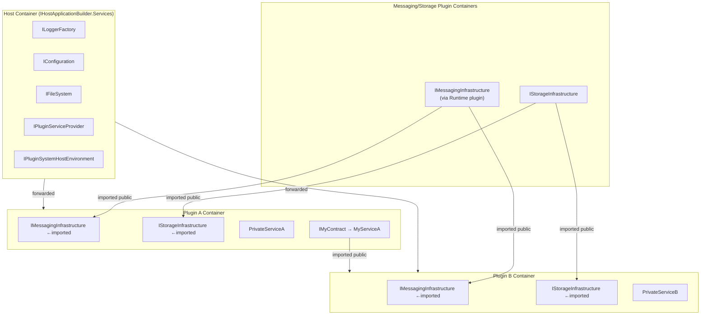
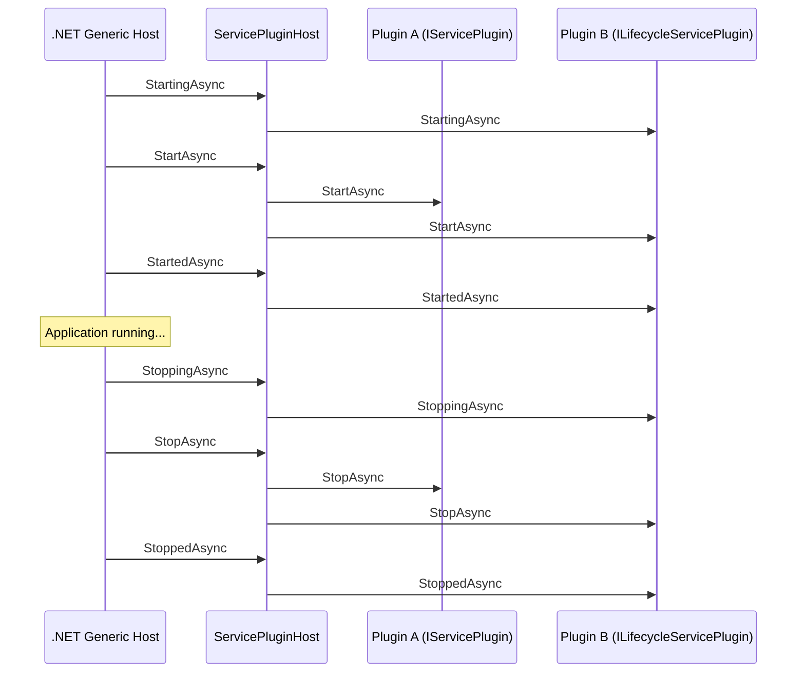
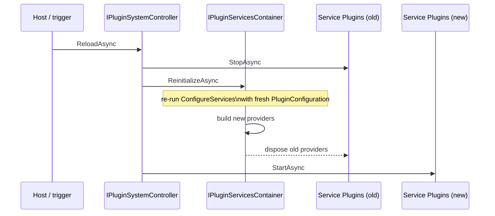

# Plugin System

The plugin system (`SAF.PluginSystem.*`) is a **SAF-independent** assembly loading engine that:

- Scans directories for assemblies containing `IPluginManifest` implementations
- Creates an **isolated `IServiceProvider`** for each discovered plug-in
- Forwards a set of **shared services** (from the host container) into every plugin container
- Manages the lifecycle of `IServicePlugin` and `ILifecycleServicePlugin` implementations
- Makes **public contract services** available for constructor injection in every plugin container
- Provides `IPluginServiceProvider` as a fallback for dynamic/late-bound cross-plugin resolution

SAF uses the plugin system as its foundation and adds messaging, storage, and host-info on top, but the plugin system itself has no dependency on SAF.

---

## Core Concepts

### IPluginManifest

Every plug-in assembly should contain **exactly one** concrete class implementing `IPluginManifest`. This is the single entry point the plugin system uses to configure the plug-in's DI container.

During discovery, the plugin loader instantiates the first concrete, non-abstract `IPluginManifest` implementation it finds and ignores assemblies that only contain the interface or other non-instantiable types.

```csharp
using Microsoft.Extensions.DependencyInjection;
using SAF.PluginSystem.Hosting.Contracts;

namespace MyPlugin;

public class PluginManifest : IPluginManifest
{
    public void ConfigureServices(IPluginSystemHostContext context, IServiceCollection pluginServices)
    {
        // Register services into the plugin's own isolated DI container
        pluginServices.AddSingleton<MyPrivateService>();
        pluginServices.AddSingleton<IMyPublicContract, MyPublicService>();

        // Register a lifecycle participant
        pluginServices.AddServicePlugin<MyBackgroundWorker>();
    }
}
```

The `IPluginSystemHostContext` provides:

| Member | Type | Description |
|---|---|---|
| `Environment` | `IPluginSystemHostEnvironment` | Environment name, plugin settings root path |
| `HostConfiguration` | `IConfiguration` | Host-wide config (e.g. `appsettings.json`) |
| `PluginConfiguration` | `IConfiguration` | Plugin-specific config (e.g. `pluginsettings.json`) |

### IServicePlugin

Implement `IServicePlugin` to participate in the host's start/stop lifecycle. Register via `AddServicePlugin<T>()`:

```csharp
using SAF.PluginSystem.Hosting.Contracts;

namespace MyPlugin;

public class MyBackgroundWorker(IMessagingInfrastructure messaging) : IServicePlugin
{
    private object? _subscription;

    public Task StartAsync(CancellationToken token)
    {
        _subscription = messaging.Subscribe("my/topic", msg => Handle(msg));
        return Task.CompletedTask;
    }

    public Task StopAsync(CancellationToken token)
    {
        if (_subscription is not null)
            messaging.Unsubscribe(_subscription);
        return Task.CompletedTask;
    }

    private void Handle(Message msg) { /* ... */ }
}
```

### ILifecycleServicePlugin

For phased initialization, implement `ILifecycleServicePlugin` (extends `IServicePlugin` with `StartingAsync`, `StartedAsync`, `StoppingAsync`, `StoppedAsync`):

```csharp
public class MyLifecyclePlugin : ILifecycleServicePlugin
{
    public Task StartingAsync(CancellationToken token)
    {
        // Called before StartAsync — open connections, acquire resources
        return Task.CompletedTask;
    }

    public Task StartAsync(CancellationToken token)
    {
        // Main start logic
        return Task.CompletedTask;
    }

    public Task StartedAsync(CancellationToken token)
    {
        // Called after StartAsync — announce readiness
        return Task.CompletedTask;
    }

    public Task StoppingAsync(CancellationToken token)
    {
        // Called before StopAsync — begin graceful shutdown
        return Task.CompletedTask;
    }

    public Task StopAsync(CancellationToken token)
    {
        // Main stop logic
        return Task.CompletedTask;
    }

    public Task StoppedAsync(CancellationToken token)
    {
        // Called after StopAsync — release resources
        return Task.CompletedTask;
    }
}
```

The lifecycle order follows `IHostedLifecycleService` semantics, executed sequentially across all plugins:

```
StartingAsync → StartAsync → StartedAsync
StoppingAsync → StopAsync  → StoppedAsync
```

---

## DI Containers

The plugin system maintains one DI container per plugin. The host forwards a fixed set of common services into every plugin container, while public contract services registered by one plugin are imported into the others.



> `IMessagingInfrastructure` and `IStorageInfrastructure` are ordinary public contract services provided by the messaging/storage plug-ins — they reach other plugin containers through the same import mechanism as any application contract, not through host forwarding.


**Key rules:**

- Services registered in a plugin container are **private by default** — other plugins cannot resolve them unless they are registered against a **publicly accessible interface** (an interface in a shared "contracts" assembly).
- Public contract services registered in any plugin container are **injected into every other plugin container** automatically — consume them via normal constructor injection.
- `IPluginServiceProvider` is available as a fallback for dynamic or late-bound scenarios but is a Service Locator — prefer constructor injection.
- If multiple plugins register the same interface and `IPluginServiceProvider` is used, `GetService<T>()` throws; use `GetServices<T>()` instead.
- Host services are **not** forwarded automatically. Only the services listed below and any `IHostServiceForwarder` registrations are bridged into plugin containers.

### Services forwarded into every plugin container

| Service | Notes |
|---|---|
| `ILoggerFactory` / `ILogger<T>` | Shared logging pipeline |
| `IPluginServiceProvider` | Cross-plugin service resolution |
| `IPluginSystemHostEnvironment` | Environment name, settings root path |
| `IFileSystem` | Abstracted file system |

Additional services can be bridged explicitly via `IHostServiceForwarder` (see below).

### IHostServiceForwarder

To forward an additional host service into every plugin container, register a `HostServiceForwarder<T>` in the host's `IServiceCollection`:

```csharp
// Register the service in the host container
services.AddSingleton<MySharedService>();

// Bridge it into every plugin container
services.AddSingleton<IHostServiceForwarder, HostServiceForwarder<MySharedService>>();
```

`HostServiceForwarder<T>` is resolved from the host container (receiving the already-built singleton via constructor injection) and calls `pluginServices.AddSingleton(instance)` for each plugin — one shared instance, no factory, no service locator.

Implement `IHostServiceForwarder` directly for more control, e.g. to register a service under a different interface:

```csharp
public sealed class MyForwarder(MySharedService service) : IHostServiceForwarder
{
    public void Forward(IServiceCollection pluginServices)
        => pluginServices.AddSingleton<IMyContract>(service);
}
```

---

## Cross-Plugin Services

### Messaging Handlers in Plug-ins (Required)

If a plug-in uses typed messaging subscriptions (`Subscribe<TMessageHandler>()`), the handler type **must** be registered via the extensions from `SAF.Messaging.Extensions`.

Do **not** register message handlers only as `IMessageHandler` (for example `AddSingleton<IMessageHandler, MyHandler>()`).
The SAF messaging runtime resolves handlers by their concrete type. Interface-only registrations are not resolved.

Required setup in the plug-in manifest:

```csharp
using SAF.Messaging.Extensions;

public void ConfigureServices(IPluginSystemHostContext context, IServiceCollection pluginServices)
{
    pluginServices.AddSingletonMessageHandler<MyHandler>();
    // or pluginServices.AddTransientMessageHandler<MyHandler>();

    pluginServices.AddMessageHandlerResolver();
}
```

If this is not configured, typed handlers will not be resolved by SAF's messaging system.

### Registering a Public Service

In your plugin manifest, register the service against a **contract interface** defined in a shared assembly:

```csharp
// MyApp.Contracts assembly (referenced by both plugins and the host)
public interface IOrderService
{
    IEnumerable<Order> GetPending();
}
```

```csharp
// Plugin A manifest
pluginServices.AddSingleton<IOrderService, OrderServiceImpl>();
```

### Consuming a Public Service from Another Plugin

The plugin system automatically makes public contract services available in every plugin container. Consume them via **constructor injection** — no service locator needed:

```csharp
// Plugin B — IOrderService is injected directly from Plugin A's registration
public class OrderConsumer(IOrderService orderService)
{
    public void ProcessOrders()
    {
        var orders = orderService.GetPending();
        // ...
    }
}
```

> The host must make the contracts assembly discoverable through `PluginContractsSearchPattern` so the plugin system can recognise the public types. When you use `AddSafHost()`, SAF's own contract assemblies are already included and your configured patterns only need to cover additional application-specific contracts.

### IPluginServiceProvider (fallback only)

For dynamic or late-bound scenarios where the service type is not known at compile time, `IPluginServiceProvider` is available. Prefer constructor injection whenever possible — `IPluginServiceProvider` is a Service Locator.

```csharp
// Use only when constructor injection is not applicable
public class DynamicConsumer(IPluginServiceProvider pluginServices)
{
    public void ProcessOrders()
    {
        var orders = pluginServices.GetService<IOrderService>();
        // ...
    }
}
```

---

## Using the Plugin System Without SAF

The plugin system has no dependency on SAF infrastructure. You can use it with a plain .NET host:

```csharp
var builder = Host.CreateApplicationBuilder(args);

var pluginSystemBuilder = builder.AddPluginSystem(options =>
{
    options.PluginSettingsRootPath = "./config";
});

pluginSystemBuilder.AddPluginAssemblyFolderContainer(options =>
{
    options.SearchRootPath = AppContext.BaseDirectory;
    options.IncludePatterns = "MyApp.Plugin.*.dll";
});

// Register host services that should be forwarded into every plugin container
builder.Services.AddSingleton<IMySharedService, MySharedService>();
builder.Services.AddSingleton<IHostServiceForwarder, HostServiceForwarder<IMySharedService>>();

var host = builder.Build();
await host.RunAsync();
```

Services are **not** forwarded into plugin containers automatically. Use `IHostServiceForwarder` / `HostServiceForwarder<T>` to bridge specific host services explicitly.

---

## Assembly Validation (optional)

Plugin assembly validation is opt-in. SAF does not enable validators by default.

To validate plug-ins before loading, register one or more `IPluginAssemblyValidator` implementations. Validators are executed in registration order and can reject loading by returning `PluginAssemblyValidationResult.Rejected(...)`.

Contracts for this feature (`IPluginAssemblyValidator`, `PluginAssemblyValidationContext`, `PluginAssemblyValidationResult`) are part of `SAF.PluginSystem.Hosting.Contracts`.

SAF provides built-in validators in `SAF.PluginSystem.Hosting.Extensions`:

- `AddStrongNamePluginAssemblyValidator(...)`
- `AddDigitalSignaturePluginAssemblyValidator(...)`

```csharp
using SAF.PluginSystem.Hosting;

var builder = Host.CreateApplicationBuilder(args);

var pluginSystemBuilder = builder.AddPluginSystem(_ => { });

pluginSystemBuilder.AddPluginAssemblyFolderContainer(options =>
{
    options.SearchRootPath = AppContext.BaseDirectory;
    options.IncludePatterns = "MyApp.Plugin.*.dll";
});

// Optional strong-name validation
pluginSystemBuilder.AddStrongNamePluginAssemblyValidator(options =>
{
    options.RequireStrongName = true;
    options.AllowedPublicKeyTokens.Add("0011223344556677");
});

// Optional Authenticode validation
pluginSystemBuilder.AddDigitalSignaturePluginAssemblyValidator(options =>
{
    options.RequireValidDigitalSignature = true;
    options.AllowedSignerThumbprints.Add("AABBCCDDEEFF00112233445566778899AABBCCDD");
});
```

Custom validation can be added with your own validator implementation:

```csharp
using SAF.PluginSystem.Hosting;
using SAF.PluginSystem.Hosting.Contracts;

public sealed class MyAssemblyValidator : IPluginAssemblyValidator
{
    public PluginAssemblyValidationResult Validate(PluginAssemblyValidationContext context)
    {
        // custom checks based on context.AssemblyPath / context.AssemblyName
        return PluginAssemblyValidationResult.Accepted();
    }
}

// Register in chain order
pluginSystemBuilder.AddPluginAssemblyValidator<MyAssemblyValidator>();
```

---

## Plugin Settings

All plugins share a single plugin settings file, exposed to each manifest as `context.PluginConfiguration`. The plugin system loads it from:

```
{PluginSettingsRootPath}/{PluginSettingsFilePath}
```

with `PluginSettingsRootPath` defaulting to `.` and `PluginSettingsFilePath` defaulting to `./pluginsettings.json`. An optional environment-specific overlay named `{file}.{EnvironmentName}.json` (e.g. `pluginsettings.Development.json`) is layered on top if present. Both paths come from the `PluginSystem` configuration section.

`PluginSystemOptions` stays a pure data object (paths/patterns only). To add further plugin configuration providers from outside (for example XML, INI, custom sources, or application-specific file names/extensions), use the host builder API:

```csharp
var builder = Host.CreateApplicationBuilder(args);

var pluginSystemBuilder = builder.AddPluginSystem(options =>
{
    options.PluginSettingsRootPath = "./config";
    options.PluginSettingsFilePath = "./pluginsettings.json";
});

pluginSystemBuilder.AddPluginConfigurationSource(config =>
    config.AddXmlFile("./config/pluginsettings.myapp", optional: true, reloadOnChange: true));

pluginSystemBuilder.AddPluginConfigurationSource(config =>
    config.AddXmlFile(
        $"./config/pluginsettings.{builder.Environment.EnvironmentName}.myapp",
        optional: true,
        reloadOnChange: true));
```

Additional providers are appended after the default plugin JSON sources. Configuration precedence follows normal .NET rules (later providers override earlier ones).

Because the file is shared, plugins keep their settings under distinct top-level sections (the built-in messaging/storage plugins use `Messaging`, `Redis`, `Nats`, `LiteDb`, `SQLite`, `MessageRouting`).

Access your section via `context.PluginConfiguration` in `ConfigureServices`:

```csharp
public void ConfigureServices(IPluginSystemHostContext context, IServiceCollection pluginServices)
{
    pluginServices.Configure<MyPluginOptions>(
        context.PluginConfiguration.GetSection("MyPlugin"));
}
```

Example `pluginsettings.json`:

```json
{
  "MyPlugin": {
    "IntervalSeconds": 10,
    "Topic": "myapp/events/ping"
  }
}
```

> A plugin may also fall back to host configuration (`context.HostConfiguration`) — the built-in plugins read their section from `PluginConfiguration` first and fall back to `HostConfiguration`. In the simplest setups you can point `PluginSettingsFilePath` at the host's `appsettings.json` and keep everything in one file.
>
> If you use `AddXmlFile(...)`, add the package `Microsoft.Extensions.Configuration.Xml` to the host project.


---

## Lifecycle Sequence Diagram



---

## Live Reload (Reconfiguration)

The plugin system can rebuild its DI containers **in-process** from the current
`context.PluginConfiguration`, without restarting the host and without recreating the underlying
assembly load contexts (ALCs). This enables live reconfiguration: after the plugin settings change,
each manifest's `ConfigureServices` runs again against the fresh configuration, producing new plugin
service instances while the loaded assemblies stay in place.

Two APIs cooperate:

| API | Assembly | Responsibility |
|---|---|---|
| `IPluginServicesContainer.ReinitializeAsync(CancellationToken)` | `SAF.PluginSystem.Hosting.Contracts` | Rebuilds the plugin service providers, then disposes the previous ones. Leaves the plugin assembly containers / ALCs untouched. |
| `IPluginSystemController.ReloadAsync(CancellationToken)` | `SAF.PluginSystem.Hosting.Contracts` | Host-level orchestration: stops the running `IServicePlugin`s, calls `ReinitializeAsync`, then starts the service plugins again. |

`IPluginSystemController` is registered automatically by `AddPluginSystem` — resolve it from the host
container (or via constructor injection) and call `ReloadAsync` when the configuration changes:

```csharp
public class ConfigChangeWatcher(IPluginSystemController pluginSystem)
{
    // e.g. wired to IOptionsMonitor.OnChange or a file watcher
    public Task OnConfigurationChangedAsync(CancellationToken token)
        => pluginSystem.ReloadAsync(token);
}
```

### What a reload does — and does not — do

- **Rebuilds** every plugin's DI container by re-running `IPluginManifest.ConfigureServices` with the
  current `PluginConfiguration`, and re-imports the public cross-plugin services.
- **Disposes** the previously built service providers (and the singletons they own) after the new
  providers are ready.
- **Restarts** the `IServicePlugin`s via `ReloadAsync` (stop → reinitialize → start). Per-plugin
  start/stop failures are logged and do not abort the reload.
- **Keeps** the assembly load contexts. `PluginAssemblyLoadContext` is **not** collectible, so rebuilding
  providers instead of recreating ALCs avoids leaking assemblies over repeated reloads.
- **Does not** pick up a plugin binary that was absent at startup — a newly deployed plugin DLL still
  requires a controlled host restart.

> **Reload-safe plugins:** because instances are recreated on every reload, plugins must not rely on
> mutable process-wide static state surviving a reload, and any resources opened in `StartAsync` must be
> released in `StopAsync` so the disposed provider can be reclaimed.

> **Fresh configuration values:** the plugin system builds `PluginConfiguration` from the plugin
> settings file(s) with `reloadOnChange: true`, so the backing `IConfigurationRoot` refreshes its
> providers when the file changes on disk. A subsequent `ReinitializeAsync` / `ReloadAsync` therefore
> re-runs `ConfigureServices` against the updated values without a restart. Consumers that only need to
> observe changed values (without rebuilding instances) can register on the change directly, e.g. via
> `IOptionsMonitor<T>.OnChange(...)` or `ChangeToken.OnChange(() => config.GetReloadToken(), ...)`.

### Reload Sequence Diagram



