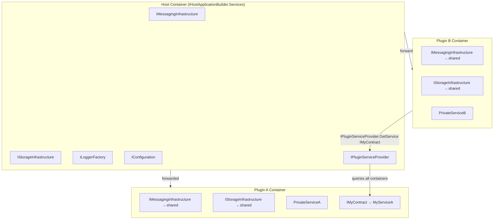
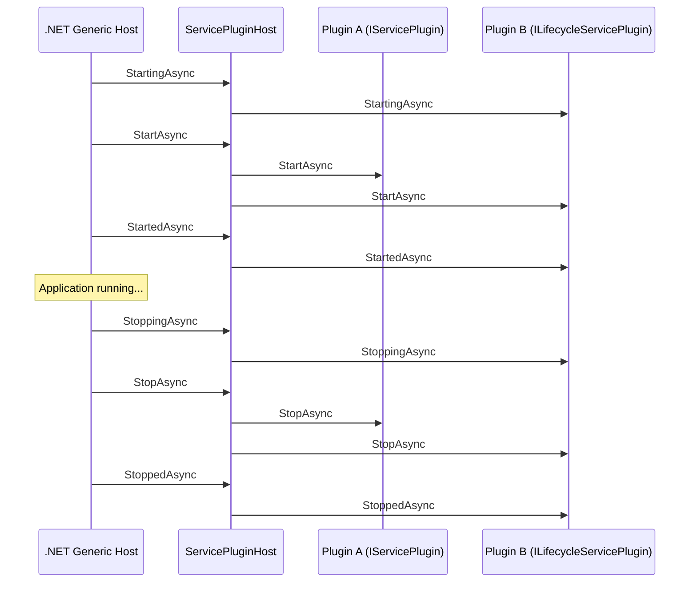

# Plugin System

The plugin system (`SAF.PluginSystem.*`) is a **SAF-independent** assembly loading engine that:

- Scans directories for assemblies containing `IPluginManifest` implementations
- Creates an **isolated `IServiceProvider`** for each discovered plug-in
- Forwards a set of **shared services** (from the host container) into every plugin container
- Manages the lifecycle of `IServicePlugin` and `ILifecycleServicePlugin` implementations
- Allows **typed cross-plugin service resolution** through `IPluginServiceProvider`

SAF uses the plugin system as its foundation and adds messaging, storage, and host-info on top, but the plugin system itself has no dependency on SAF.

---

## Core Concepts

### IPluginManifest

Every plug-in assembly should contain **exactly one** concrete class implementing `IPluginManifest`. This is the single entry point the plugin system uses to configure the plug-in's DI container.

During discovery, the plugin loader instantiates the first concrete, non-abstract `IPluginManifest` implementation it finds and ignores assemblies that only contain the interface or other non-instantiable types.

```csharp
using Microsoft.Extensions.DependencyInjection;
using SAF.PluginSystem.Hosting.Contracts;

namespace MyPlugin;

public class PluginManifest : IPluginManifest
{
    public void ConfigureServices(IPluginSystemHostContext context, IServiceCollection pluginServices)
    {
        // Register services into the plugin's own isolated DI container
        pluginServices.AddSingleton<MyPrivateService>();
        pluginServices.AddSingleton<IMyPublicContract, MyPublicService>();

        // Register a lifecycle participant
        pluginServices.AddServicePlugin<MyBackgroundWorker>();
    }
}
```

The `IPluginSystemHostContext` provides:

| Member | Type | Description |
|---|---|---|
| `Environment` | `IPluginSystemHostEnvironment` | Environment name, plugin settings root path |
| `HostConfiguration` | `IConfiguration` | Host-wide config (e.g. `appsettings.json`) |
| `PluginConfiguration` | `IConfiguration` | Plugin-specific config (e.g. `pluginsettings.json`) |

### IServicePlugin

Implement `IServicePlugin` to participate in the host's start/stop lifecycle. Register via `AddServicePlugin<T>()`:

```csharp
using SAF.PluginSystem.Hosting.Contracts;

namespace MyPlugin;

public class MyBackgroundWorker(IMessagingInfrastructure messaging) : IServicePlugin
{
    private object? _subscription;

    public Task StartAsync(CancellationToken token)
    {
        _subscription = messaging.Subscribe("my/topic", msg => Handle(msg));
        return Task.CompletedTask;
    }

    public Task StopAsync(CancellationToken token)
    {
        if (_subscription is not null)
            messaging.Unsubscribe(_subscription);
        return Task.CompletedTask;
    }

    private void Handle(Message msg) { /* ... */ }
}
```

### ILifecycleServicePlugin

For phased initialization, implement `ILifecycleServicePlugin` (extends `IServicePlugin` with `StartingAsync`, `StartedAsync`, `StoppingAsync`, `StoppedAsync`):

```csharp
public class MyLifecyclePlugin : ILifecycleServicePlugin
{
    public Task StartingAsync(CancellationToken token)
    {
        // Called before StartAsync — open connections, acquire resources
        return Task.CompletedTask;
    }

    public Task StartAsync(CancellationToken token)
    {
        // Main start logic
        return Task.CompletedTask;
    }

    public Task StartedAsync(CancellationToken token)
    {
        // Called after StartAsync — announce readiness
        return Task.CompletedTask;
    }

    public Task StoppingAsync(CancellationToken token)
    {
        // Called before StopAsync — begin graceful shutdown
        return Task.CompletedTask;
    }

    public Task StopAsync(CancellationToken token)
    {
        // Main stop logic
        return Task.CompletedTask;
    }

    public Task StoppedAsync(CancellationToken token)
    {
        // Called after StopAsync — release resources
        return Task.CompletedTask;
    }
}
```

The lifecycle order follows `IHostedLifecycleService` semantics, executed sequentially across all plugins:

```
StartingAsync → StartAsync → StartedAsync
StoppingAsync → StopAsync  → StoppedAsync
```

---

## DI Containers

The plugin system maintains one DI container per plugin, all of which share services forwarded from the host container.



**Key rules:**

- Services registered in a plugin container are **private by default** — other plugins cannot resolve them unless they are registered against a **publicly accessible interface** (an interface in a shared "contracts" assembly).
- `IPluginServiceProvider` is the only mechanism for one plugin to consume a service from another plugin. It aggregates all plugin containers.
- If multiple plugins register the same interface, `GetService<T>()` throws; use `GetServices<T>()` instead.

---

## Cross-Plugin Services

### Registering a Public Service

In your plugin manifest, register the service against a **contract interface** defined in a shared assembly:

```csharp
// MyApp.Contracts assembly (referenced by both plugins and the host)
public interface IOrderService
{
    IEnumerable<Order> GetPending();
}
```

```csharp
// Plugin A manifest
pluginServices.AddSingleton<IOrderService, OrderServiceImpl>();
```

### Consuming a Public Service from Another Plugin

In Plugin B, inject `IPluginServiceProvider` and resolve:

```csharp
public class OrderConsumer(IPluginServiceProvider pluginServices)
{
    public void ProcessOrders()
    {
        var orders = pluginServices.GetService<IOrderService>();
        // ...
    }
}
```

> The host must include the contracts assembly in `PluginContractsSearchPattern` so the plugin system can recognise the public types.

---

## Using the Plugin System Without SAF

The plugin system has no dependency on SAF infrastructure. You can use it with a plain .NET host:

```csharp
var builder = Host.CreateApplicationBuilder(args);

var pluginSystemBuilder = builder.AddPluginSystem(options =>
{
    options.PluginSettingsRootPath = "./config";
});

pluginSystemBuilder.AddPluginAssemblyFolderContainer(options =>
{
    options.SearchRootPath = AppContext.BaseDirectory;
    options.IncludePatterns = "MyApp.Plugin.*.dll";
});

// Register host services that should be available in every plugin container
builder.Services.AddSingleton<IMySharedService, MySharedService>();

var host = builder.Build();
await host.RunAsync();
```

Any service registered in `builder.Services` before `Build()` is automatically forwarded into plugin containers. This is how SAF injects `IMessagingInfrastructure` and `IStorageInfrastructure`.

---

## Plugin Settings

Each plugin can have its own `pluginsettings.json` file. The plugin system loads it from:

```
{PluginSettingsRootPath}/{AssemblyName}/pluginsettings.json
```

Access it via `context.PluginConfiguration` in `ConfigureServices`:

```csharp
public void ConfigureServices(IPluginSystemHostContext context, IServiceCollection pluginServices)
{
    pluginServices.Configure<MyPluginOptions>(
        context.PluginConfiguration.GetSection("MyPlugin"));
}
```

Example `config/MyApp.Plugin.Publisher/pluginsettings.json`:

```json
{
  "MyPlugin": {
    "IntervalSeconds": 10,
    "Topic": "myapp/events/ping"
  }
}
```

---

## Lifecycle Sequence Diagram


