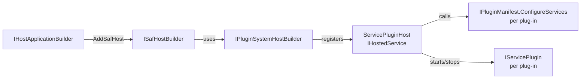
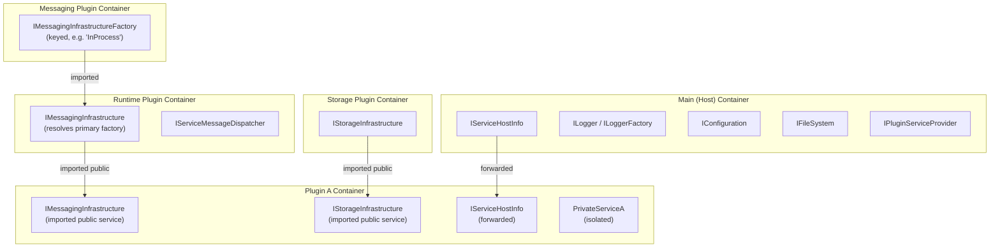

# SAF Host

The SAF Host is the top-level composition root for a SAF application. It wraps .NET's `IHostApplicationBuilder` (i.e. `Host.CreateApplicationBuilder`) and wires together the plugin system, service host info, and optional diagnostics. Messaging and storage infrastructure are **not** registered by the host directly — they are supplied by dedicated plug-ins and selected through configuration (see below).

## How It Fits Together



## Minimal Setup

```csharp
var builder = Host.CreateApplicationBuilder(args);

builder.AddSafHost()
    .ConfigurePluginSystem(ps => ps.AddPluginAssemblyFolderContainer(options =>
    {
        options.SearchRootPath = AppContext.BaseDirectory;
        // Include your plug-ins AND the messaging/storage implementation plug-ins.
        options.IncludePatterns =
            "MyApp.Plugin.*.dll;SAF.Messaging.InProcess.dll;SAF.Storage.LiteDb.dll";
        options.Recursive = false;
    }));

var host = builder.Build();
await host.RunAsync();
```

Messaging and storage are provided by plug-ins, selected via configuration:

```json
{
  "Messaging": { "PrimaryKey": "InProcess" },
  "LiteDb":    { "ConnectionString": "Filename=app.db" }
}
```

`AddSafHost()` reads plugin system configuration from the `"PluginSystem"` section and service host info from the `"ServiceHost"` section of your configuration (e.g. `appsettings.json`). It also registers SAF's built-in plugin assemblies from the application base directory using an explicit allow-list.

At the moment the built-in list contains:

- `SAF.Messaging.Runtime.dll`

---

## Configuration

### PluginSystem section

Controls how plug-ins are discovered and configured:

```json
{
  "PluginSystem": {
    "PluginSettingsRootPath": "./config",
    "PluginSettingsFilePath": "./pluginsettings.json",
    "PluginContractsSearchPattern": "MyApp.Contracts.dll"
  }
}
```

| Key | Default | Description |
|---|---|---|
| `PluginSettingsRootPath` | `./config` | Root directory for per-plugin `pluginsettings.json` files |
| `PluginSettingsFilePath` | `./pluginsettings.json` | Path relative to `PluginSettingsRootPath` for the plugin's settings file |
| `PluginContractsSearchPattern` | `SAF.Common.dll;SAF.Messaging.Contracts.dll` via `AddSafHost()` | Semicolon-separated glob patterns for additional assemblies exposing public plugin service types |

`AddSafHost()` always includes SAF's built-in contract assemblies and appends any `PluginContractsSearchPattern` entries from configuration, so applications only need to specify additional contracts such as `MyApp.Contracts.dll`.

### ServiceHost section

Controls host identity and file system paths:

```json
{
  "ServiceHost": {
    "Id": "my-unique-node-id",
    "ServiceHostType": "MyApp",
    "FileSystemUserBasePath": "tempfs",
    "FileSystemInstallationPath": ".",
    "EnableDiagnostics": false
  }
}
```

| Key | Default | Description |
|---|---|---|
| `Id` | *(auto-generated GUID)* | Unique identifier of this host instance |
| `ServiceHostType` | `"SAF"` | Logical type label for the host |
| `FileSystemUserBasePath` | `"tempfs"` | Base directory for application-specific runtime data |
| `FileSystemInstallationPath` | `AppContext.BaseDirectory` | Installation root directory |
| `EnableDiagnostics` | `false` | Write diagnostic node-info to disk on startup |

### Messaging section

Required by `SAF.Messaging.Runtime` to select which messaging factory to expose as the primary `IMessagingInfrastructure`:

```json
{
  "Messaging": {
    "PrimaryKey": "InProcess"
  }
}
```

The value must match one of the well-known keys: `InProcess`, `Redis`, `Nats`, `Cde`, `Routing`.

---

## Programmatic Configuration

You can also configure the host entirely in code, without `appsettings.json`:

```csharp
builder.AddSafHost(pluginSystemOptions =>
{
    pluginSystemOptions.PluginSettingsRootPath = "./config";
    pluginSystemOptions.PluginContractsSearchPattern = "MyContracts.dll";
})
.ConfigureHostInfo(hostOptions =>
{
    hostOptions.Id = "node-1";
    hostOptions.ServiceHostType = "Demo";
    hostOptions.FileSystemUserBasePath = Path.Combine(AppContext.BaseDirectory, "data");
})
.ConfigurePluginSystem(ps =>
{
    ps.AddPluginConfigurationSource(config =>
        config.AddXmlFile("./config/pluginsettings.myapp", optional: true, reloadOnChange: true));

    ps.AddPluginConfigurationSource(config =>
        config.AddXmlFile(
            $"./config/pluginsettings.{builder.Environment.EnvironmentName}.myapp",
            optional: true,
            reloadOnChange: true));

    ps.AddPluginAssemblyFolderContainer(options =>
    {
        options.SearchRootPath = AppContext.BaseDirectory;
        options.IncludePatterns = "MyApp.Plugin.*.dll";
        options.Recursive = false;
    });
})
.AddHostDiagnostics();
```

If you use `AddXmlFile(...)`, add the package `Microsoft.Extensions.Configuration.Xml` to the host project.

---

## Plugin Assembly Discovery

`AddSafHost()` already registers SAF's built-in plugin assembly (`SAF.Messaging.Runtime.dll`) from `AppContext.BaseDirectory`.

Additional `AddPluginAssemblyFolderContainer` calls should therefore be used for application-specific or externally deployed plugins.

The `AddPluginAssemblyFolderContainer` call controls which DLL files are scanned for `IPluginManifest` implementations.

```csharp
ps.AddPluginAssemblyFolderContainer(options =>
{
    // Root directory to search in
    options.SearchRootPath = AppContext.BaseDirectory;

    // Whether to recurse into subdirectories
    options.Recursive = false;

    // Semicolon-separated file glob patterns to include
    options.IncludePatterns = "MyApp.Plugin.*.dll";

    // Semicolon-separated patterns to exclude
    options.ExcludePatterns = "Microsoft.*;System.*;SAF.PluginSystem.*";
});
```

You can call `AddPluginAssemblyFolderContainer` multiple times to add assemblies from different directories.

---

## Diagnostics

Enable diagnostics to write host info (version, paths, environment) to disk at startup:

```csharp
builder.AddSafHost().AddHostDiagnostics();
```

Or via configuration:

```json
{ "ServiceHost": { "EnableDiagnostics": true } }
```

---

## IServiceHostInfo

Every plug-in can inject `IServiceHostInfo` to read host identity and path information at runtime:

```csharp
public class MyPlugin(IServiceHostInfo hostInfo)
{
    public void DoWork()
    {
        var dataPath = hostInfo.FileSystemUserBasePath;
        var id       = hostInfo.Id;
    }
}
```

`IServiceHostInfo` is registered once in the host container by `AddSafHost()` and forwarded into every plugin container automatically via `IHostServiceForwarder`. Plugins receive the same singleton instance that the host uses, including any programmatic overrides applied via `ConfigureHostInfo`.

---

## Forwarding Host Services into Plugin Containers

The plugin system calls all `IHostServiceForwarder` registrations before each plugin manifest's `ConfigureServices` runs. SAF uses this to bridge `IServiceHostInfo` into the isolated plugin containers without re-creating it.

You can forward additional host-level services the same way using the built-in `HostServiceForwarder<T>`:

```csharp
// Anywhere in host setup — e.g. your own ServiceCollectionExtensions
services.AddSingleton<MySharedSingleton>();
services.AddSingleton<IHostServiceForwarder, HostServiceForwarder<MySharedSingleton>>();
```

`HostServiceForwarder<T>` receives the already-resolved host singleton via constructor injection and registers the **same instance** in each plugin container — no factory, no service locator.

---

## DI Container Layout

The host container holds services that `AddSafHost()` forwards into every plugin container (`IServiceHostInfo`, loggers, configuration, `IPluginServiceProvider`, `IFileSystem`, `IPluginSystemHostEnvironment`).

`IMessagingInfrastructure` and `IStorageInfrastructure` are **not** in the host container. They are registered inside the messaging/storage **plugin** containers and shared with other plugin containers as *public services* (because their contract assemblies — `SAF.Messaging.Contracts.dll`, `SAF.Common.dll` — are in `PluginContractsSearchPattern`).



**Two distinct sharing mechanisms:**
- **Host → plugin forwarding** (`IServiceHostInfo`, loggers, `IFileSystem`, …) via `IHostServiceForwarder` / `RedirectCommonServices`.
- **Plugin → plugin imports** for public contract types (`IMessagingInfrastructure`, `IMessagingInfrastructureFactory`, `IServiceMessageDispatcher`, `IStorageInfrastructure`) matched by `PluginContractsSearchPattern`.

Private plugin services (registered against non-contract types) remain invisible to other plugins.

> For a full explanation of the DI model, see [Plugin System — DI Containers](./plugin-system.md#di-containers).
